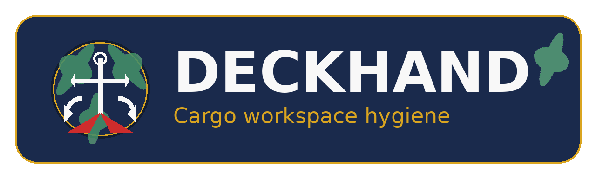
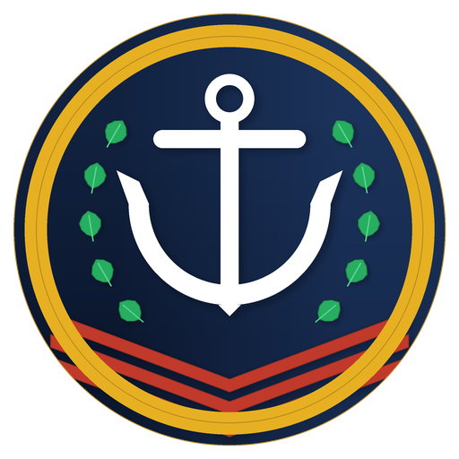

<div align="center">
  
  <br><br>
  <strong>Deterministic multi-language build-surface maintenance and hygiene agent.</strong>
  <br><br>
</div>

If [kaptaind] is who decides what gets shipped, **Deckhand** is what makes sure the ship is clean enough to sail.



[kaptaind]: https://github.com/elci-group/kaptaind

## Install

```bash
git clone https://github.com/elci-group/deckhand.git
cd deckhand
./install.sh
```

## Quick start

```bash
# Create deckhand.toml for the current project
deckhand init

# Show disk usage of build artifacts and caches
deckhand status

# Clean build artifacts across all detected languages
deckhand clean

# Sweep stale artifacts older than 30 days
deckhand sweep

# Dry-run any destructive command
deckhand clean --dry-run
deckhand sweep --dry-run
```

## Supported languages

Deckhand detects and cleans build artifacts for:

- **Rust** (`Cargo.toml`) — `cargo clean`
- **Node.js** (`package.json`) — framework-aware output dirs, `npm/pnpm/yarn/bun run clean`
- **Python** (`pyproject.toml`, `setup.py`, `setup.cfg`) — bytecode caches, dist/build dirs
- **Go** (`go.mod`, `go.work`) — `go clean`
- **Swift** (`Package.swift`) — `swift package clean`
- **Gradle** (`build.gradle[.kts]`) — `./gradlew clean` / `gradle clean`

See [docs/LANGUAGES.md](docs/LANGUAGES.md) for the full manifest/artifact matrix.

## Commands

| Command | Purpose |
|---------|---------|
| `deckhand init` | Generate `deckhand.toml` and `.deckhandignore` |
| `deckhand status` | Report build artifact/cache disk usage |
| `deckhand clean` | Run native clean commands across detected build systems |
| `deckhand sweep` | Prune stale build artifacts and caches |

## Configuration

`deckhand init` creates a `deckhand.toml` tailored to the project it detects.

```toml
[workspace]
path = "."
members = "auto"

[clean]
profiles = ["debug", "release"]
keep_incremental = false
keep_days = 0
languages = ["cargo", "node", "python", "go", "swift", "gradle"]
allow_native_commands = true
remove_node_modules = false
remove_venvs = false

[sweep]
registry_cache = true
git_checkouts = true
keep_registry_days = 30
node_modules = false
python_bytecode = true
go_build_cache = false
swift_derived_data = false

[status]
warn_free_percent = 10
```

### Backward compatibility

Existing `deckhand.toml` files that do not specify `[clean].languages` continue to run only the Cargo driver, preserving previous Cargo-only behavior. New projects or configs without a `deckhand.toml` file enable all language drivers by default.

## License

MIT
