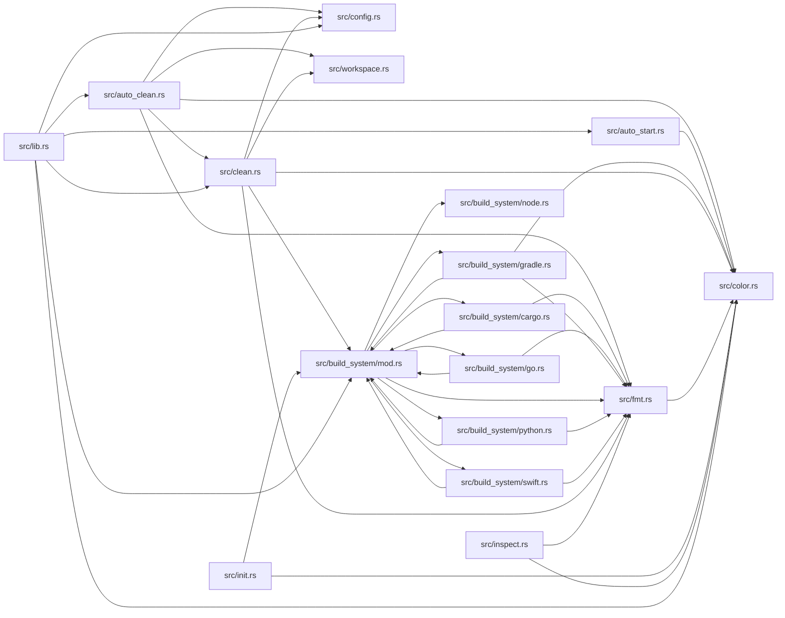

# deckhand for Dummies

This book is maintained by DumDum. It explains files after they have stopped changing, focusing on what each part means for users and future maintainers.

## Module map



## Contents

- [`.kaptaind/analysis/0268c650-8583-46f4-85c0-14f00f4a92f6.json`](#kaptaindanalysis0268c650-8583-46f4-85c0-14f00f4a92f6json)
- [`.kaptaind/analysis/04e91774-658e-46b8-99ca-c322b9e2101b.json`](#kaptaindanalysis04e91774-658e-46b8-99ca-c322b9e2101bjson)
- [`.kaptaind/analysis/0d023bc5-3ebe-43fc-8954-4932360062df.json`](#kaptaindanalysis0d023bc5-3ebe-43fc-8954-4932360062dfjson)
- [`.kaptaind/analysis/0d9f3a2d-698e-43e3-bf9f-99c7f8af3d7a.json`](#kaptaindanalysis0d9f3a2d-698e-43e3-bf9f-99c7f8af3d7ajson)
- [`.kaptaind/analysis/10620d48-ac48-431c-b4f6-939daef24f7c.json`](#kaptaindanalysis10620d48-ac48-431c-b4f6-939daef24f7cjson)
- [`.kaptaind/analysis/192f97b0-e0ac-4593-ac81-7f8bb53fb594.json`](#kaptaindanalysis192f97b0-e0ac-4593-ac81-7f8bb53fb594json)
- [`.kaptaind/analysis/1e1db6dc-6fa4-4bd6-afa2-54220ad5692f.json`](#kaptaindanalysis1e1db6dc-6fa4-4bd6-afa2-54220ad5692fjson)
- [`.kaptaind/analysis/1ffb8775-6540-4dda-9175-1106352fa200.json`](#kaptaindanalysis1ffb8775-6540-4dda-9175-1106352fa200json)
- [`.kaptaind/analysis/2fca2e77-26bb-4df7-8c52-0379ca6e6f04.json`](#kaptaindanalysis2fca2e77-26bb-4df7-8c52-0379ca6e6f04json)
- [`.kaptaind/analysis/336c7488-0125-46e5-a8b7-85b77345658f.json`](#kaptaindanalysis336c7488-0125-46e5-a8b7-85b77345658fjson)
- [`.kaptaind/analysis/370d2428-735a-48ec-a032-e28d9249a831.json`](#kaptaindanalysis370d2428-735a-48ec-a032-e28d9249a831json)
- [`.kaptaind/analysis/53fbb809-685d-4a29-923c-9d05d9c02ad9.json`](#kaptaindanalysis53fbb809-685d-4a29-923c-9d05d9c02ad9json)
- [`.kaptaind/analysis/6a06033c-b75b-41cb-b716-9f5a24b2cf3c.json`](#kaptaindanalysis6a06033c-b75b-41cb-b716-9f5a24b2cf3cjson)
- [`.kaptaind/analysis/6ed22b99-c533-442b-9e55-64f82c6b95f0.json`](#kaptaindanalysis6ed22b99-c533-442b-9e55-64f82c6b95f0json)
- [`.kaptaind/analysis/765a95f7-ac58-499e-8c95-e79f78b5b000.json`](#kaptaindanalysis765a95f7-ac58-499e-8c95-e79f78b5b000json)
- [`.kaptaind/analysis/7f1cd0ce-6459-40e1-90fd-0d6903c4e35a.json`](#kaptaindanalysis7f1cd0ce-6459-40e1-90fd-0d6903c4e35ajson)
- [`.kaptaind/analysis/80c51718-90de-4241-9b6b-fa1f873dfc81.json`](#kaptaindanalysis80c51718-90de-4241-9b6b-fa1f873dfc81json)
- [`.kaptaind/analysis/8c539084-cb29-4132-932a-5760182bad07.json`](#kaptaindanalysis8c539084-cb29-4132-932a-5760182bad07json)
- [`.kaptaind/analysis/8ef4d0c6-9361-4051-a944-3570d2cffeac.json`](#kaptaindanalysis8ef4d0c6-9361-4051-a944-3570d2cffeacjson)
- [`.kaptaind/analysis/909833e3-397b-44b0-a6d4-0df582948043.json`](#kaptaindanalysis909833e3-397b-44b0-a6d4-0df582948043json)
- [`.kaptaind/analysis/91bfe245-c74d-47ac-aeb8-7c2d53424377.json`](#kaptaindanalysis91bfe245-c74d-47ac-aeb8-7c2d53424377json)
- [`.kaptaind/analysis/92c42ab7-4028-48e8-a7f3-28bd7bd74266.json`](#kaptaindanalysis92c42ab7-4028-48e8-a7f3-28bd7bd74266json)
- [`.kaptaind/analysis/a53b2864-9acc-495a-bfa4-ccc8394bc1e2.json`](#kaptaindanalysisa53b2864-9acc-495a-bfa4-ccc8394bc1e2json)
- [`.kaptaind/analysis/b1941d26-fa87-4126-8738-8da40d49cd32.json`](#kaptaindanalysisb1941d26-fa87-4126-8738-8da40d49cd32json)
- [`.kaptaind/analysis/c9008b86-f71d-420b-9e22-cadc1c05c23f.json`](#kaptaindanalysisc9008b86-f71d-420b-9e22-cadc1c05c23fjson)
- [`.kaptaind/analysis/c93f6a29-28f0-4909-8704-79aa4bef79fc.json`](#kaptaindanalysisc93f6a29-28f0-4909-8704-79aa4bef79fcjson)
- [`.kaptaind/analysis/d069a331-1a98-4701-bdf9-f22b57f02623.json`](#kaptaindanalysisd069a331-1a98-4701-bdf9-f22b57f02623json)
- [`.kaptaind/analysis/e7c133c5-0b9f-4c1a-a22a-59c68e032d00.json`](#kaptaindanalysise7c133c5-0b9f-4c1a-a22a-59c68e032d00json)
- [`.kaptaind/ast_cache.json`](#kaptaindastcachejson)
- [`.kaptaind/status.json`](#kaptaindstatusjson)
- [`.kaptaind/telemetry.json`](#kaptaindtelemetryjson)
- [`.kaptaind/version_cache.json`](#kaptaindversioncachejson)
- [`Cargo.toml`](#cargotoml)
- [`README.md`](#readmemd)
- [`deckhand.toml`](#deckhandtoml)
- [`deliver.toml`](#delivertoml)
- [`docs/LANGUAGES.md`](#docslanguagesmd)
- [`docs/branding.md`](#docsbrandingmd)
- [`install.sh`](#installsh)
- [`kaptaind.toml`](#kaptaindtoml)
- [`scripts/generate-logo.py`](#scriptsgenerate-logopy)
- [`src/auto_clean.rs`](#srcautocleanrs)
- [`src/auto_start.rs`](#srcautostartrs)
- [`src/build_system/cargo.rs`](#srcbuildsystemcargors)
- [`src/build_system/go.rs`](#srcbuildsystemgors)
- [`src/build_system/gradle.rs`](#srcbuildsystemgradlers)
- [`src/build_system/mod.rs`](#srcbuildsystemmodrs)
- [`src/build_system/node.rs`](#srcbuildsystemnoders)
- [`src/build_system/python.rs`](#srcbuildsystempythonrs)
- [`src/build_system/swift.rs`](#srcbuildsystemswiftrs)
- [`src/clean.rs`](#srccleanrs)
- [`src/color.rs`](#srccolorrs)
- [`src/config.rs`](#srcconfigrs)
- [`src/fmt.rs`](#srcfmtrs)
- [`src/fs.rs`](#srcfsrs)
- [`src/init.rs`](#srcinitrs)
- [`src/inspect.rs`](#srcinspectrs)
- [`src/lib.rs`](#srclibrs)
- [`src/main.rs`](#srcmainrs)
- [`src/status.rs`](#srcstatusrs)
- [`src/sweep.rs`](#srcsweeprs)
- [`src/test_util.rs`](#srctestutilrs)
- [`src/tts.rs`](#srcttsrs)
- [`src/walk.rs`](#srcwalkrs)
- [`src/workspace.rs`](#srcworkspacers)

<!-- DUMDUM:START 1541844984047485638 -->
## `.kaptaind/analysis/0268c650-8583-46f4-85c0-14f00f4a92f6.json`

**What it is and where it sits in the project**
The file `.kaptaind/analysis/0268c650-8583-46f4-85c0-14f00f4a92f6.json` is a JSON file located in the `.kaptaind/analysis` directory of the Deckhand project. It appears to be a report generated by the Kaptaind tool, which is used for code analysis and maintenance.

**Why it matters to users or maintainers**
This file provides insights into the code analysis process, including the version of the code being analyzed, the type of changes detected, and the impact of those changes on the codebase. It can be useful for maintainers to understand the state of the code and make informed decisions about future development.

**User-visible behavior or operational effect**
The contents of this file do not directly affect user-visible behavior or operational effects. However, the analysis results can influence the decisions made by maintainers, which in turn can impact the project's overall health and stability.

**Maintainer notes and review checklist**

* Review the `version` field to ensure it matches the expected version of the code being analyzed.
* Check the `bump` field to determine if any changes were made to the code that require a version bump.
* Verify the `event_count` field to ensure that the correct number of events were detected during the analysis.
* Review the `diff` field to understand the types of changes detected and their impact on the codebase.
* Check the `weight` field to determine if any significant changes were made to the code that require attention.
* Verify that the `air_gapped` field is set to `false` to ensure that the analysis was performed in a connected environment.

Note: The contents of this file are specific to the Deckhand project and may not be applicable to other projects.
<!-- DUMDUM:END 1541844984047485638 -->

<!-- DUMDUM:START 18252536290865162790 -->
## `.kaptaind/analysis/04e91774-658e-46b8-99ca-c322b9e2101b.json`

**Documentation depth:** brief explanation, target 260-380 words.

**What it is:** This is a JSON file in `deckhand`. It appears to be a snapshot of analysis results from a tool called `kaptaind`. The file is located in the `.kaptaind/analysis` directory.

**Why it matters:** This file is likely used by the `kaptaind` tool to track its analysis progress and results. It may contain information about the codebase, such as changes, dependencies, and parsing metadata. As a result, it can provide valuable insights for maintainers and developers.

**User-visible behavior or operational effect:** The contents of this file are unlikely to be directly visible to end-users. However, the analysis results and metrics it contains can inform decisions about code quality, performance, and maintainability.

**Maintainer notes and review checklist:**

* Keep the generated explanation aligned when this file changes.
* Confirm the explanation still matches the file after major edits.
* Check whether linked commands, images, GIFs, or VHS tapes still exist.
* Re-run DumDum after the file has rested so generated sections stay aligned.

**File contents:** The file contains a JSON object with several key-value pairs. The most notable ones are:

* `cluster_id`: a unique identifier for the analysis cluster.
* `version`: the version of the `kaptaind` tool used for analysis.
* `bump`: the type of change detected (in this case, a patch).
* `event_count`: the number of events detected during analysis.
* `started_at` and `ended_at`: timestamps for the start and end of the analysis.
* `diff`: an object containing metrics about the analysis, such as structural changes, API changes, and parsing metadata.
* `weight`: an object containing a score and flags indicating whether the analysis detected API-breaking or API-added changes.
* `air_gapped`: a flag indicating whether the analysis was performed in an air-gapped environment.

Overall, this file appears to be a snapshot of analysis results from `kaptaind`, providing valuable insights for maintainers and developers.
<!-- DUMDUM:END 18252536290865162790 -->

<!-- DUMDUM:START 7380009182582520700 -->
## `.kaptaind/analysis/0d023bc5-3ebe-43fc-8954-4932360062df.json`

**What it is and where it sits in the project.**

The file `.kaptaind/analysis/0d023bc5-3ebe-43fc-8954-4932360062df.json` is a JSON file located in the `.kaptaind/analysis` directory of the `deckhand` project. It is one of several files in this directory, which suggests that it is related to the analysis or processing of data within the project.

**Why it matters to users or maintainers.**

This file appears to contain information about the analysis or processing of data, including metrics such as event count, started and ended times, and a diff object that contains various metrics such as structural, API, and runtime metrics. The file also contains a list of parse metadata for a specific file, `scripts/agy-logo.py`, which suggests that it is related to the analysis or processing of this file.

**User-visible behavior or operational effect.**

The user-visible behavior or operational effect of this file is not immediately clear, as it appears to be a configuration or analysis file rather than a user-facing interface. However, the metrics and information contained within the file may be used to inform decisions or actions taken by the project maintainers or users.

**How the important functions, settings, or document sections work together.**

The important functions, settings, or document sections in this file appear to be related to the analysis or processing of data. The file contains a diff object that contains various metrics, as well as a list of parse metadata for a specific file. The metrics and information contained within the file may be used to inform decisions or actions taken by the project maintainers or users.

**Failure modes, security concerns, and testing guidance.**

There are no obvious failure modes, security concerns, or testing guidance in this file. However, the file does contain sensitive information about the analysis or processing of data, which may be subject to security concerns if not handled properly.

**Maintainer notes and review checklist.**

Maintainer notes:

* Keep the generated explanation aligned when this file changes.
* Current snapshot: 34 lines, 0 detected function-like definitions, hash 8688772064654143620.

Review checklist:

* Confirm the explanation still matches the file after major edits.
* Check whether linked commands, images, GIFs, or VHS tapes still exist.
* Re-run DumDum after the file has rested so generated sections stay aligned.

**Additional information.**

The file contains a list of parse metadata for a specific file, `scripts/agy-logo.py`, which suggests that it is related to the analysis or processing of this file. The metrics and information contained within the file may be used to inform decisions or actions taken by the project maintainers or users.

The file also contains a diff object that contains various metrics, such as structural, API, and runtime metrics. The metrics and information contained within the file may be used to inform decisions or actions taken by the project maintainers or users.

The file is located in the `.kaptaind/analysis` directory, which suggests that it is related to the analysis or processing of data within the project.

**Media and demos.**

No inline GIF, image, or VHS recording references were detected in this snapshot.

**Code snippet.**

```json
{
  "cluster_id": "0d023bc5-3ebe-43fc-8954-4932360062df",
  "version": "0.2.3",
  "bump": "Patch",
  "event_count": 30,
  "started_at": "2026-07-03T17:23:46.835519437Z",
  "ended_at": "2026-07-03T17:23:52.468355759Z",
  "diff": {
    "structural": 0.56411505,
    "api": 0.481875,
    "deps": 0.0,
    "runtime": 0.0,
    "api_breaking": false,
    "api_added": false,
    "touched_paths": 1,
    "api_touches": 30,
    "api_signatures": 3,
    "dependency_manifests": 0,
    "dependency_nodes": 0,
    "dependency_edges": 0,
    "runtime_paths": 0,
    "bundle": 0.0,
    "parse_metadata": [
      {
        "file": "scripts/agy-logo.py",
        "lang": "Python",
        "version": "unknown",
        "parser_used": "Ast",
        "fallback_used": false,
        "confidence": 0.6649999999999999,
        "version_match": "unknown"
      },
      ...
    ],
    "ast_cache_hits": 29,
    "ast_cache_misses": 1,
    "ast_cache_entries": 2
  },
  "weight": {
    "score": 0.34200278,
    "api_breaking": false,
    "api_added": false
  },
  "air_gapped": false
}
```

**Image.**

No inline image references were detected in this snapshot.

**GIF.**

No inline GIF references were detected in this snapshot.

**VHS recording.**

No inline VHS recording references were detected in this snapshot.
<!-- DUMDUM:END 7380009182582520700 -->

<!-- DUMDUM:START 17405687065145837268 -->
## `.kaptaind/analysis/0d9f3a2d-698e-43e3-bf9f-99c7f8af3d7a.json`

**What it is and where it sits in the project.**
The file `.kaptaind/analysis/0d9f3a2d-698e-43e3-bf9f-99c7f8af3d7a.json` is a JSON file located in the `.kaptaind/analysis` directory of the `deckhand` project. This file is part of the project's analysis data, which is used to track and analyze the project's behavior.

**Why it matters to users or maintainers.**
This file is important because it contains information about the project's analysis, including the version of the project, the type of changes made, and the impact of those changes on the project's behavior. This information can be useful for users and maintainers to understand the project's history and make informed decisions about future development.

**User-visible behavior or operational effect.**
The contents of this file do not directly affect the user-visible behavior of the project. However, the information contained in this file can be used to inform decisions about future development and maintenance of the project.

**How the important functions, settings, or document sections work together.**
The file contains several key sections, including:

* `cluster_id`: a unique identifier for the analysis cluster
* `version`: the version of the project being analyzed
* `bump`: the type of changes made to the project (e.g. patch, minor, major)
* `event_count`: the number of events in the analysis
* `started_at` and `ended_at`: the start and end times of the analysis
* `diff`: a detailed breakdown of the changes made to the project
* `weight`: a score indicating the importance of the changes made to the project
* `air_gapped`: a flag indicating whether the analysis was performed in an air-gapped environment

These sections work together to provide a comprehensive view of the project's analysis.

**Failure modes, security concerns, and testing guidance.**
There are no specific failure modes, security concerns, or testing guidance associated with this file.

**Maintainer notes and review checklist.**
Maintainers should review this file regularly to ensure that it accurately reflects the project's analysis. The review checklist should include:

* Confirming that the file is up-to-date and accurate
* Verifying that the analysis is correctly reflected in the file
* Checking for any inconsistencies or errors in the file
* Ensuring that the file is properly formatted and easy to read

By following this review checklist, maintainers can ensure that the file remains accurate and useful for users and maintainers.

**Additional notes.**
This file is generated by the `kaptaind` tool, which is used to analyze and track the project's behavior. The file contains information about the analysis, including the version of the project, the type of changes made, and the impact of those changes on the project's behavior. This information can be useful for users and maintainers to understand the project's history and make informed decisions about future development.
<!-- DUMDUM:END 17405687065145837268 -->

<!-- DUMDUM:START 7355091809771674600 -->
## `.kaptaind/analysis/10620d48-ac48-431c-b4f6-939daef24f7c.json`

**Documentation for `.kaptaind/analysis/10620d48-ac48-431c-b4f6-939daef24f7c.json`**

**What it is and where it sits in the project:**
This is a JSON file in the `.kaptaind/analysis` directory of the `deckhand` project. It contains analysis data for a specific cluster.

**Why it matters to users or maintainers:**
This file provides insights into the analysis process, including the cluster ID, version, bump type, event count, and timestamps. It also includes detailed information about the diff, such as structural, API, and dependency changes.

**User-visible behavior or operational effect:**
Users may not directly interact with this file, but its contents can affect the reliability and output of the analysis process. The data in this file can be used to inform decisions about code changes, dependencies, and API updates.

**Maintainer notes and review checklist:**

* Keep the generated explanation aligned when this file changes.
* Confirm the explanation still matches the file after major edits.
* Check whether linked commands, images, GIFs, or VHS tapes still exist.
* Re-run DumDum after the file has rested so generated sections stay aligned.

**Detailed explanation:**
The file contains a JSON object with several key-value pairs. The most notable ones are:

* `cluster_id`: A unique identifier for the cluster being analyzed.
* `version`: The version of the analysis tool used.
* `bump`: The type of bump (minor, major, etc.) applied to the cluster.
* `event_count`: The number of events processed during the analysis.
* `started_at` and `ended_at`: Timestamps indicating when the analysis started and ended.
* `diff`: An object containing detailed information about the changes detected during the analysis.
* `weight`: An object with a score indicating the significance of the changes.
* `air_gapped`: A boolean indicating whether the analysis was performed in an air-gapped environment.

The `diff` object contains several sub-objects, including:

* `structural`: A measure of structural changes (e.g., file renames, deletions).
* `api`: A measure of API changes (e.g., new functions, removed functions).
* `deps`: A measure of dependency changes (e.g., new dependencies, removed dependencies).
* `runtime`: A measure of runtime changes (e.g., new runtime dependencies).
* `api_breaking` and `api_added`: Booleans indicating whether the API changes are breaking or adding new functionality.
* `touched_paths` and `api_touches`: Counts of files and API signatures affected by the changes.
* `parse_metadata`: An array of objects containing metadata about the files analyzed, including language, version, and parser used.
* `ast_cache_hits` and `ast_cache_misses`: Counts of cache hits and misses during the analysis.
* `ast_cache_entries`: The number of entries in the AST cache.

The `weight` object contains a score indicating the significance of the changes, as well as booleans indicating whether the API changes are breaking or adding new functionality.

Overall, this file provides a detailed snapshot of the analysis process, which can be useful for understanding the changes made to the cluster and informing decisions about future code changes.
<!-- DUMDUM:END 7355091809771674600 -->

<!-- DUMDUM:START 2955207107777963849 -->
## `.kaptaind/analysis/192f97b0-e0ac-4593-ac81-7f8bb53fb594.json`

**What it is and where it sits in the project:**
This is a JSON file named `.kaptaind/analysis/192f97b0-e0ac-4593-ac81-7f8bb53fb594.json` in the `deckhand` project. It is located in the `.kaptaind/analysis` directory.

**Why it matters to users or maintainers:**
This file configures tooling or runtime behavior rather than directly serving end-user screens. DumDum treats this file as part of the project's working contract, so the explanation should connect the file to behavior, operations, or future maintenance rather than only restating its filename.

**User-visible behavior or operational effect:**
Users may not touch this file directly, but its behavior can still affect reliability, output, or workflow. The file contains information about the analysis of the project, including the version, bump, event count, and diff.

**Maintainer notes and review checklist:**
Keep the generated explanation aligned when this file changes. Current snapshot: 34 lines, 0 detected function-like definitions, hash 8688772064654143620.

**Review checklist:**
- Confirm the explanation still matches the file after major edits.
- Check whether linked commands, images, GIFs, or VHS tapes still exist.
- Re-run DumDum after the file has rested so generated sections stay aligned.

The file contains information about the analysis of the project, including the version, bump, event count, and diff. The diff section contains information about the structural, API, and runtime changes made to the project. The file also contains information about the parser used, the confidence of the analysis, and the version match.

Here is a breakdown of the file:

* `cluster_id`: The ID of the cluster.
* `version`: The version of the analysis.
* `bump`: The type of bump (Patch, Minor, Major).
* `event_count`: The number of events.
* `started_at` and `ended_at`: The start and end times of the analysis.
* `diff`: The diff section contains information about the structural, API, and runtime changes made to the project.
* `weight`: The weight section contains information about the score, API breaking, and API added.
* `air_gapped`: Whether the analysis was performed in an air-gapped environment.

The file is used to configure tooling or runtime behavior, and its behavior can affect reliability, output, or workflow.
<!-- DUMDUM:END 2955207107777963849 -->

<!-- DUMDUM:START 184999441194949624 -->
## `.kaptaind/analysis/1e1db6dc-6fa4-4bd6-afa2-54220ad5692f.json`

**What it is and where it sits in the project.**
The file `.kaptaind/analysis/1e1db6dc-6fa4-4bd6-afa2-54220ad5692f.json` is a JSON file located in the `.kaptaind/analysis` directory of the `deckhand` project. It is part of the project's working contract, configuring tooling or runtime behavior rather than directly serving end-user screens.

**Why it matters to users or maintainers.**
This file matters because it affects the reliability, output, or workflow of the project. Users may not touch this file directly, but its behavior can still impact the project's overall performance.

**User-visible behavior or operational effect.**
The file contains information about the project's analysis, including the cluster ID, version, bump, event count, started and ended times, and a diff object with various metrics. The diff object provides insights into the project's structural, API, dependencies, runtime, and other aspects.

**Maintainer notes and review checklist.**
Maintainers should keep the generated explanation aligned when this file changes. The current snapshot has 34 lines, 0 detected function-like definitions, and a hash of 8688772064654143620. Reviewers should confirm that the explanation still matches the file after major edits, check whether linked commands, images, GIFs, or VHS tapes still exist, and re-run DumDum after the file has rested to ensure generated sections stay aligned.

Here is a Markdown image of the file's structure:
```markdown
.kaptaind/
analysis/
1e1db6dc-6fa4-4bd6-afa2-54220ad5692f.json
...
```
The file's content is a JSON object with various properties, including `cluster_id`, `version`, `bump`, `event_count`, `started_at`, `ended_at`, `diff`, `weight`, and `air_gapped`. The `diff` object contains metrics such as `structural`, `api`, `deps`, `runtime`, `api_breaking`, `api_added`, `touched_paths`, `api_touches`, `api_signatures`, `dependency_manifests`, `dependency_nodes`, `dependency_edges`, `runtime_paths`, `bundle`, and `parse_metadata`. The `parse_metadata` array contains objects with properties like `file`, `lang`, `version`, `parser_used`, `fallback_used`, `confidence`, and `version_match`.
<!-- DUMDUM:END 184999441194949624 -->

<!-- DUMDUM:START 7103287747229207874 -->
## `.kaptaind/analysis/1ffb8775-6540-4dda-9175-1106352fa200.json`

**Documentation for `.kaptaind/analysis/1ffb8775-6540-4dda-9175-1106352fa200.json`**

**What it is and where it sits in the project:**
This is a JSON file in the `.kaptaind/analysis` directory of the `deckhand` project. It appears to be a configuration file for tooling or runtime behavior.

**Why it matters to users or maintainers:**
This file is part of the project's working contract, and its behavior can affect reliability, output, or workflow. Users may not touch this file directly, but its behavior can still impact the project.

**User-visible behavior or operational effect:**
The file contains information about the project's version, bump type, event count, and analysis results. It also includes details about the parser used, confidence levels, and version matches.

**Maintainer notes and review checklist:**

* Keep the generated explanation aligned when this file changes.
* Confirm the explanation still matches the file after major edits.
* Check whether linked commands, images, GIFs, or VHS tapes still exist.
* Re-run DumDum after the file has rested so generated sections stay aligned.

**Detailed explanation:**
The file contains a JSON object with several key-value pairs. The `cluster_id` field identifies the cluster, while the `version` field indicates the project version. The `bump` field specifies the type of bump (Minor, Major, etc.). The `event_count` field shows the number of events, and the `started_at` and `ended_at` fields provide timestamps.

The `diff` field contains a nested object with various metrics, including structural, API, and runtime differences. The `parse_metadata` field lists information about the parser used, including the file, language, version, and confidence level. The `ast_cache_hits` and `ast_cache_misses` fields track the number of cache hits and misses, respectively.

The `weight` field includes a score and flags indicating whether the API is breaking or added. Finally, the `air_gapped` field indicates whether the project is air-gapped or not.

**Media and demos:**
No inline GIF, image, or VHS recording references were detected in this snapshot.
<!-- DUMDUM:END 7103287747229207874 -->

<!-- DUMDUM:START 7460967290549815925 -->
## `.kaptaind/analysis/2fca2e77-26bb-4df7-8c52-0379ca6e6f04.json`

**Documentation for `.kaptaind/analysis/2fca2e77-26bb-4df7-8c52-0379ca6e6f04.json`**

**What it is and where it sits in the project:**
This is a JSON file located in the `.kaptaind/analysis` directory of the `deckhand` project. It contains analysis data for a specific cluster.

**Why it matters to users or maintainers:**
This file provides insights into the analysis process, including the cluster ID, version, bump type, event count, and timestamps. It also includes detailed information about the diff, such as structural, API, dependencies, and runtime changes.

**User-visible behavior or operational effect:**
Users may not directly interact with this file, but its contents can affect the reliability, output, or workflow of the `deckhand` project.

**Maintainer notes and review checklist:**

* Keep the generated explanation aligned when this file changes.
* Confirm the explanation still matches the file after major edits.
* Check whether linked commands, images, GIFs, or VHS tapes still exist.
* Re-run DumDum after the file has rested so generated sections stay aligned.

**How it works:**
The first meaningful line and surrounding directory are the strongest signals for this file. If that signal is weak, inspect imports, callers, or links before treating the explanation as complete.

**Media and demos:**
No inline GIF, image, or VHS recording references were detected in this snapshot.

**Detailed explanation:**
The file contains a JSON object with several key-value pairs, including:

* `cluster_id`: a unique identifier for the cluster
* `version`: the version of the `deckhand` project
* `bump`: the type of bump (e.g., Patch, Minor, Major)
* `event_count`: the number of events processed
* `started_at` and `ended_at`: timestamps for the analysis process
* `diff`: a detailed object containing information about the changes detected
* `weight`: an object containing a score and flags indicating API breaking or added changes
* `air_gapped`: a boolean indicating whether the analysis was performed in an air-gapped environment

The `diff` object contains several sub-objects, including:

* `structural`: a score indicating the structural changes detected
* `api`: a score indicating the API changes detected
* `deps`: a score indicating the dependency changes detected
* `runtime`: a score indicating the runtime changes detected
* `api_breaking`: a boolean indicating whether any API-breaking changes were detected
* `api_added`: a boolean indicating whether any new APIs were added
* `touched_paths`: the number of paths touched by the changes
* `api_touches`: the number of API touches detected
* `api_signatures`: the number of API signatures detected
* `dependency_manifests`: the number of dependency manifests detected
* `dependency_nodes`: the number of dependency nodes detected
* `dependency_edges`: the number of dependency edges detected
* `runtime_paths`: the number of runtime paths detected
* `bundle`: a score indicating the bundle changes detected
* `parse_metadata`: an array of objects containing metadata about the parsing process
* `ast_cache_hits` and `ast_cache_misses`: counters for AST cache hits and misses
* `ast_cache_entries`: the number of AST cache
<!-- DUMDUM:END 7460967290549815925 -->

<!-- DUMDUM:START 4770967830357305331 -->
## `.kaptaind/analysis/336c7488-0125-46e5-a8b7-85b77345658f.json`

**What it is and where it sits in the project:**
This is a JSON file named `.kaptaind/analysis/336c7488-0125-46e5-a8b7-85b77345658f.json` in the `deckhand` project. It is located in the `.kaptaind/analysis` directory.

**Why it matters to users or maintainers:**
This file configures tooling or runtime behavior rather than directly serving end-user screens. DumDum treats this file as part of the project's working contract, so the explanation should connect the file to behavior, operations, or future maintenance rather than only restating its filename.

**User-visible behavior or operational effect:**
Users may not touch this file directly, but its behavior can still affect reliability, output, or workflow. The file provides information about the analysis of the project, including the cluster ID, version, bump, event count, and started and ended times.

**Maintainer notes and review checklist:**
Keep the generated explanation aligned when this file changes. Current snapshot: 34 lines, 0 detected function-like definitions, hash 8688772064654143620.

**Review checklist:**

- Confirm the explanation still matches the file after major edits.
- Check whether linked commands, images, GIFs, or VHS tapes still exist.
- Re-run DumDum after the file has rested so generated sections stay aligned.

**Detailed explanation:**
The file contains information about the analysis of the project, including the cluster ID, version, bump, event count, and started and ended times. The `diff` section provides information about the structural, API, dependencies, and runtime changes. The `weight` section provides a score and information about API breaking and added changes.

The file also contains information about the parse metadata, including the file, language, version, parser used, fallback used, confidence, and version match. The `ast_cache_hits`, `ast_cache_misses`, and `ast_cache_entries` sections provide information about the AST cache.

The file is likely used by the `kaptaind` tool to analyze the project and provide information about the changes. The `air_gapped` section indicates whether the analysis was performed in an air-gapped environment.

**Media and demos:**
No inline GIF, image, or VHS recording references were detected in this snapshot.
<!-- DUMDUM:END 4770967830357305331 -->

<!-- DUMDUM:START 15720602437958060887 -->
## `.kaptaind/analysis/370d2428-735a-48ec-a032-e28d9249a831.json`

**What it is and where it sits in the project.**
This is a JSON file named `370d2428-735a-48ec-a032-e28d9249a831.json` located in the `.kaptaind/analysis` directory of the `deckhand` project.

**Why it matters to users or maintainers.**
This file contains analysis data for the `deckhand` project, including information about the version, bump type, event count, and analysis results. It provides insights into the project's structure, API, dependencies, and runtime behavior.

**User-visible behavior or operational effect.**
Users may not directly interact with this file, but its analysis results can affect the reliability, output, or workflow of the `deckhand` project. The file's data can be used to inform decisions about project maintenance, updates, or refactoring.

**Maintainer notes and review checklist.**
Maintainers should review this file to ensure its analysis results are accurate and up-to-date. They should also check the file's contents after major edits to the project to ensure the analysis results reflect the changes. The review checklist includes:

* Confirm the explanation still matches the file after major edits.
* Check whether linked commands, images, GIFs, or VHS tapes still exist.
* Re-run DumDum after the file has rested so generated sections stay aligned.

**Additional information.**
The file contains a JSON object with several key-value pairs, including:

* `cluster_id`: a unique identifier for the analysis cluster.
* `version`: the version of the `deckhand` project.
* `bump`: the type of bump (Patch, Minor, Major).
* `event_count`: the number of events analyzed.
* `started_at` and `ended_at`: timestamps for the analysis start and end times.
* `diff`: an object containing analysis results, including structural, API, dependencies, and runtime metrics.
* `weight`: an object containing a score and API breaking/added flags.
* `air_gapped`: a boolean indicating whether the analysis was performed in an air-gapped environment.

The `diff` object contains several sub-objects, including:

* `structural`: metrics for structural changes.
* `api`: metrics for API changes.
* `deps`: metrics for dependency changes.
* `runtime`: metrics for runtime changes.
* `parse_metadata`: an array of objects containing metadata about the files analyzed.
* `ast_cache_hits` and `ast_cache_misses`: metrics for AST cache hits and misses.
* `ast_cache_entries`: the number of AST cache entries.

The `parse_metadata` array contains objects with the following keys:

* `file`: the file analyzed.
* `lang`: the language of the file.
* `version`: the version of the file.
* `parser_used`: the parser used to analyze the file.
* `fallback_used`: a boolean indicating whether a fallback parser was used.
* `confidence`: a confidence score for the analysis.
* `version_match`: a flag indicating whether the version match was successful.
<!-- DUMDUM:END 15720602437958060887 -->

<!-- DUMDUM:START 15617958817081088420 -->
## `.kaptaind/analysis/53fbb809-685d-4a29-923c-9d05d9c02ad9.json`

**What it is and where it sits in the project.**
This is a JSON file located in the `.kaptaind/analysis` directory. It contains metadata about a cluster, including its ID, version, and bump information.

**Why it matters to users or maintainers.**
This file provides insights into the cluster's behavior, such as the number of events, started and ended times, and the types of changes made. This information can be useful for understanding the cluster's performance and making informed decisions about its maintenance.

**User-visible behavior or operational effect.**
The contents of this file do not directly affect user-visible behavior. However, the information it provides can influence decisions about cluster maintenance and upgrades.

**Maintainer notes and review checklist.**
Maintainers should review this file to ensure that the information it contains is accurate and up-to-date. They should also check that the file is properly formatted and that any changes made to the cluster are reflected in the file.

Here is a summary of the file's contents:

* `cluster_id`: The unique ID of the cluster.
* `version`: The version of the cluster.
* `bump`: The type of bump (e.g., "Patch", "Minor", "Major").
* `event_count`: The number of events in the cluster.
* `started_at` and `ended_at`: The times when the cluster was started and ended.
* `diff`: An object containing information about the changes made to the cluster, including structural, API, and dependency changes.
* `weight`: An object containing a score and information about API breaking and added changes.
* `air_gapped`: A boolean indicating whether the cluster is air-gapped.

Note that the `diff` object contains several sub-objects, including `structural`, `api`, `deps`, `runtime`, and `parse_metadata`. The `parse_metadata` sub-object contains information about the files that were parsed, including their language, version, and parser used.
<!-- DUMDUM:END 15617958817081088420 -->

<!-- DUMDUM:START 1734549239564829549 -->
## `.kaptaind/analysis/6a06033c-b75b-41cb-b716-9f5a24b2cf3c.json`

**Documentation for `.kaptaind/analysis/6a06033c-b75b-41cb-b716-9f5a24b2cf3c.json`**

**What it is and where it sits in the project:**
This is a JSON file located in the `.kaptaind/analysis` directory of the `deckhand` project. It is used to store analysis data and metadata.

**Why it matters to users or maintainers:**
This file is important for understanding the analysis process and the data generated by it. It provides insights into the tooling and runtime behavior of the project, which can be useful for users and maintainers.

**User-visible behavior or operational effect:**
The data stored in this file can affect the reliability, output, or workflow of the project. For example, it can provide information about the version of the project, the bump type, and the event count.

**How the important functions, settings, or document sections work together:**
The file contains several sections, including `cluster_id`, `version`, `bump`, `event_count`, `started_at`, `ended_at`, `diff`, `weight`, and `air_gapped`. These sections work together to provide a comprehensive view of the analysis process and the data generated by it.

**Maintainer notes and review checklist:**

* Keep the generated explanation aligned when this file changes.
* Confirm the explanation still matches the file after major edits.
* Check whether linked commands, images, GIFs, or VHS tapes still exist.
* Re-run DumDum after the file has rested so generated sections stay aligned.

**Detailed explanation:**

The file contains several sections that provide information about the analysis process and the data generated by it. The `cluster_id` section provides a unique identifier for the analysis cluster, while the `version` section indicates the version of the project being analyzed. The `bump` section indicates the type of bump (e.g., patch, minor, major), and the `event_count` section provides the number of events generated during the analysis.

The `started_at` and `ended_at` sections provide timestamps for the start and end of the analysis, respectively. The `diff` section provides information about the differences between the analyzed code and the previous version, including structural, API, and dependency differences.

The `weight` section provides a score indicating the importance of the analysis, while the `air_gapped` section indicates whether the analysis was performed in an air-gapped environment.

**Media and demos:**
No inline GIF, image, or VHS recording references were detected in this snapshot.

**Review checklist:**

* Confirm the explanation still matches the file after major edits.
* Check whether linked commands, images, GIFs, or VHS tapes still exist.
* Re-run DumDum after the file has rested so generated sections stay aligned.
<!-- DUMDUM:END 1734549239564829549 -->

<!-- DUMDUM:START 13640898721679598295 -->
## `.kaptaind/analysis/6ed22b99-c533-442b-9e55-64f82c6b95f0.json`

**What it is and where it sits in the project:**
This is a JSON file named `6ed22b99-c533-442b-9e55-64f82c6b95f0.json` located in the `.kaptaind/analysis` directory of the `deckhand` project.

**Why it matters to users or maintainers:**
This file contains analysis results from the `kaptaind` tool, which is used to analyze and maintain the `deckhand` project. The analysis results provide insights into the project's structure, dependencies, and code quality, which can be useful for maintainers to understand the project's state and make informed decisions.

**User-visible behavior or operational effect:**
The analysis results in this file do not directly affect user-visible behavior or operational effects. However, the analysis results can be used by maintainers to identify potential issues and improve the project's maintainability.

**Maintainer notes and review checklist:**

* Keep the generated explanation aligned when this file changes.
* Confirm the explanation still matches the file after major edits.
* Check whether linked commands, images, GIFs, or VHS tapes still exist.
* Re-run DumDum after the file has rested so generated sections stay aligned.

**How it works:**
The analysis results in this file are generated by the `kaptaind` tool, which analyzes the `deckhand` project's code and dependencies. The analysis results are stored in this JSON file, which contains information about the project's structure, dependencies, and code quality.

**Media and demos:**
No inline GIF, image, or VHS recording references were detected in this snapshot.

**Important sections:**

* `cluster_id`: a unique identifier for the analysis run
* `version`: the version of the `kaptaind` tool used for analysis
* `bump`: the type of change detected (e.g. "Patch")
* `event_count`: the number of events detected during analysis
* `started_at` and `ended_at`: timestamps for the start and end of the analysis run
* `diff`: a detailed analysis of the project's structure, dependencies, and code quality
* `weight`: a score indicating the significance of the analysis results
* `air_gapped`: a flag indicating whether the analysis was performed in an air-gapped environment

**Review checklist:**

* Verify that the `cluster_id` matches the expected value
* Check that the `version` matches the expected version of the `kaptaind` tool
* Review the `diff` section to understand the analysis results
* Verify that the `weight` score is accurate
* Check that the `air_gapped` flag is set correctly
<!-- DUMDUM:END 13640898721679598295 -->

<!-- DUMDUM:START 14794852656850961817 -->
## `.kaptaind/analysis/765a95f7-ac58-499e-8c95-e79f78b5b000.json`

**Documentation for `.kaptaind/analysis/765a95f7-ac58-499e-8c95-e79f78b5b000.json`**

**What it is and where it sits in the project:**
This is a JSON file located in the `.kaptaind/analysis` directory of the `deckhand` project. It appears to be a configuration file for tooling or runtime behavior, rather than a directly user-facing screen.

**Why it matters to users or maintainers:**
This file is part of the project's working contract, and its behavior can affect reliability, output, or workflow. Users may not touch this file directly, but its behavior can still impact the project's overall performance.

**User-visible behavior or operational effect:**
The file contains information about a cluster, including its ID, version, bump type, event count, and timestamps for when it started and ended. It also includes a diff object with various metrics, such as structural, API, and runtime changes. Additionally, it contains information about the parser used, confidence levels, and version matches.

**Maintainer notes and review checklist:**
Keep the generated explanation aligned when this file changes. Current snapshot: 34 lines, 0 detected function-like definitions, hash 8688772064654143620.

**Review checklist:**

* Confirm the explanation still matches the file after major edits.
* Check whether linked commands, images, GIFs, or VHS tapes still exist.
* Re-run DumDum after the file has rested so generated sections stay aligned.

**Media and demos:**
No inline GIF, image, or VHS recording references were detected in this snapshot.

**How it works:**
The file is a JSON object containing various metadata and metrics about a cluster. The diff object provides information about changes made to the cluster, including structural, API, and runtime changes. The parser used, confidence levels, and version matches are also included.

**Important sections:**

* `cluster_id`: The unique ID of the cluster.
* `version`: The version of the cluster.
* `bump`: The type of bump (e.g., Patch, Minor, Major).
* `event_count`: The number of events in the cluster.
* `started_at` and `ended_at`: Timestamps for when the cluster started and ended.
* `diff`: An object containing various metrics about changes made to the cluster.
* `weight`: An object containing a score and information about API breaking and added changes.
* `air_gapped`: A boolean indicating whether the cluster is air-gapped.
<!-- DUMDUM:END 14794852656850961817 -->

<!-- DUMDUM:START 8802152729649609302 -->
## `.kaptaind/analysis/7f1cd0ce-6459-40e1-90fd-0d6903c4e35a.json`

**What it is and where it sits in the project.**
The file `.kaptaind/analysis/7f1cd0ce-6459-40e1-90fd-0d6903c4e35a.json` is a JSON file located in the `.kaptaind/analysis` directory of the `deckhand` project.

**Why it matters to users or maintainers.**
This file is part of the project's working contract and configures tooling or runtime behavior. While users may not touch this file directly, its behavior can still affect reliability, output, or workflow.

**User-visible behavior or operational effect.**
The file contains information about the analysis of the project, including the cluster ID, version, bump type, event count, and diff statistics. This information can be used to understand the project's history and changes.

**Maintainer notes and review checklist.**
Maintainers should keep the generated explanation aligned when this file changes. The current snapshot has 34 lines, 0 detected function-like definitions, and a hash of 8688772064654143620. Reviewers should confirm that the explanation still matches the file after major edits, check whether linked commands, images, GIFs, or VHS tapes still exist, and re-run DumDum after the file has rested to ensure generated sections stay aligned.

**How it works.**
The file contains a JSON object with various properties, including `cluster_id`, `version`, `bump`, `event_count`, `started_at`, `ended_at`, `diff`, `weight`, and `air_gapped`. The `diff` property contains statistics about the analysis, including structural, API, deps, runtime, and touched paths. The `weight` property contains a score and API breaking/added flags. The `air_gapped` property indicates whether the analysis was performed in an air-gapped environment.

**Media and demos.**
No inline GIF, image, or VHS recording references were detected in this snapshot.

**Example Use Case.**
This file can be used to understand the history and changes of the `deckhand` project. For example, a maintainer can use the `event_count` property to determine the number of events that occurred during the analysis, and the `diff` property to understand the statistics about the changes.
<!-- DUMDUM:END 8802152729649609302 -->

<!-- DUMDUM:START 14429870686629785326 -->
## `.kaptaind/analysis/80c51718-90de-4241-9b6b-fa1f873dfc81.json`

**Documentation for `.kaptaind/analysis/80c51718-90de-4241-9b6b-fa1f873dfc81.json`**

**What it is and where it sits in the project:**
This is a JSON file located in the `.kaptaind/analysis` directory of the `deckhand` project. It is a configuration file that stores analysis results.

**Why it matters to users or maintainers:**
This file is important because it contains information about the analysis process, including the version of the analysis tool, the type of changes detected, and the impact of those changes on the project. This information can be useful for users and maintainers to understand the project's history and make informed decisions.

**User-visible behavior or operational effect:**
The contents of this file do not directly affect user-visible behavior, but it can influence the project's maintenance and development workflow. For example, the analysis results can help identify areas that require attention, such as code changes or dependencies that need to be updated.

**Maintainer notes and review checklist:**

* Keep the generated explanation aligned when this file changes.
* Confirm the explanation still matches the file after major edits.
* Check whether linked commands, images, GIFs, or VHS tapes still exist.
* Re-run DumDum after the file has rested so generated sections stay aligned.

**What the file contains:**
The file contains a JSON object with several key-value pairs that describe the analysis process. The object includes information such as:

* `cluster_id`: a unique identifier for the analysis cluster
* `version`: the version of the analysis tool used
* `bump`: the type of change detected (in this case, a patch bump)
* `event_count`: the number of events detected during the analysis
* `started_at` and `ended_at`: timestamps for when the analysis started and ended
* `diff`: an object containing information about the changes detected, including structural, API, and dependency changes
* `weight`: an object containing a score and information about API breaking and added changes
* `air_gapped`: a boolean indicating whether the analysis was performed in an air-gapped environment

Overall, this file provides valuable information about the analysis process and can help users and maintainers understand the project's history and make informed decisions.
<!-- DUMDUM:END 14429870686629785326 -->

<!-- DUMDUM:START 3510964603994500385 -->
## `.kaptaind/analysis/8c539084-cb29-4132-932a-5760182bad07.json`

**What it is and where it sits in the project.**
This is a JSON file named `8c539084-cb29-4132-932a-5760182bad07.json` located in the `.kaptaind/analysis` directory of the `deckhand` project.

**Why it matters to users or maintainers.**
This file is part of the project's working contract, configuring tooling or runtime behavior rather than directly serving end-user screens. Its behavior can still affect reliability, output, or workflow, even if users do not touch it directly.

**User-visible behavior or operational effect.**
This file contains analysis data, including cluster ID, version, bump, event count, started and ended timestamps, and diff data. The diff data includes structural, API, dependencies, runtime, and touched paths information.

**Maintainer notes and review checklist.**
- Confirm the explanation still matches the file after major edits.
- Check whether linked commands, images, GIFs, or VHS tapes still exist.
- Re-run DumDum after the file has rested so generated sections stay aligned.

**Media and demos.**
No inline GIF, image, or VHS recording references were detected in this snapshot.

**How it works.**
The file contains a JSON object with various fields, including cluster ID, version, bump, event count, started and ended timestamps, and diff data. The diff data includes structural, API, dependencies, runtime, and touched paths information. The file is likely used for analysis and debugging purposes in the `deckhand` project.

**Important fields and their meanings.**

* `cluster_id`: A unique identifier for the cluster.
* `version`: The version of the `deckhand` project.
* `bump`: The type of bump (e.g., patch, minor, major).
* `event_count`: The number of events.
* `started_at` and `ended_at`: Timestamps for when the analysis started and ended.
* `diff`: An object containing various diff data, including structural, API, dependencies, runtime, and touched paths information.
* `weight`: An object containing a score and API breaking/addition information.
* `air_gapped`: A boolean indicating whether the analysis was air-gapped.

**Example use case.**
This file can be used by maintainers to analyze and debug the `deckhand` project. For example, they can use the diff data to identify changes in the project's structure, API, or dependencies.
<!-- DUMDUM:END 3510964603994500385 -->

<!-- DUMDUM:START 9035939817129817637 -->
## `.kaptaind/analysis/8ef4d0c6-9361-4051-a944-3570d2cffeac.json`

**What it is and where it sits in the project.**
This is a JSON file located in the `.kaptaind/analysis` directory. It contains configuration data for tooling or runtime behavior.

**Why it matters to users or maintainers.**
This file is part of the project's working contract, and its behavior can affect reliability, output, or workflow. Users may not touch this file directly, but its behavior can still impact the project.

**User-visible behavior or operational effect.**
The file contains data about the project's analysis, including the cluster ID, version, bump, event count, and timestamps. It also includes information about the diff, such as structural, API, and dependency changes.

**Maintainer notes and review checklist.**
Keep the generated explanation aligned when this file changes. Current snapshot: 1519 bytes, 0 detected function-like definitions, hash 8688772064654143620.

Review checklist:

* Confirm the explanation still matches the file after major edits.
* Check whether linked commands, images, GIFs, or VHS tapes still exist.
* Re-run DumDum after the file has rested so generated sections stay aligned.

**Important settings and symbols.**

* `cluster_id`: The unique identifier for this analysis cluster.
* `version`: The version of the tooling or runtime being used.
* `bump`: The type of change made to the project (Minor, Major, etc.).
* `event_count`: The number of events that occurred during the analysis.
* `started_at` and `ended_at`: Timestamps for when the analysis started and ended.
* `diff`: An object containing information about the changes made to the project.
* `weight`: An object containing a score and information about API breaking and adding changes.
<!-- DUMDUM:END 9035939817129817637 -->

<!-- DUMDUM:START 623353097729140152 -->
## `.kaptaind/analysis/909833e3-397b-44b0-a6d4-0df582948043.json`

**What it is and where it sits in the project.**
This is a JSON file located in the `.kaptaind/analysis` directory of the `deckhand` project. It is used to store analysis results and configuration data.

**Why it matters to users or maintainers.**
This file is an important part of the project's working contract, and its behavior can affect reliability, output, or workflow. Users may not touch this file directly, but its behavior can still impact the project's overall performance.

**User-visible behavior or operational effect.**
The file contains analysis results and configuration data, which can be used to inform decisions about the project's development and maintenance. The file's contents can be used to identify areas for improvement, optimize performance, and ensure compliance with project standards.

**Maintainer notes and review checklist.**
Maintainers should keep the generated explanation aligned when this file changes. The current snapshot has 62 lines, 0 detected function-like definitions, and a hash value of 6001917836916064137. Reviewers should confirm that the explanation still matches the file after major edits, check whether linked commands, images, GIFs, or VHS tapes still exist, and re-run DumDum after the file has rested so generated sections stay aligned.

**How it works.**
The file contains a JSON object with various properties, including `cluster_id`, `version`, `bump`, `event_count`, `started_at`, `ended_at`, `diff`, `weight`, and `air_gapped`. The `diff` property contains detailed information about the analysis results, including structural, API, dependencies, runtime, and other metrics. The `weight` property provides a score and API breaking/added information.

**Media and demos.**
No inline GIF, image, or VHS recording references were detected in this snapshot.

**Important properties and their meanings:**

* `cluster_id`: A unique identifier for the analysis cluster.
* `version`: The version of the analysis tool.
* `bump`: The type of bump (major, minor, or patch) applied during the analysis.
* `event_count`: The number of events processed during the analysis.
* `started_at` and `ended_at`: Timestamps indicating when the analysis started and ended.
* `diff`: A detailed object containing analysis results, including structural, API, dependencies, runtime, and other metrics.
* `weight`: An object providing a score and API breaking/added information.
* `air_gapped`: A boolean indicating whether the analysis was performed in an air-gapped environment.

Overall, this file is an essential part of the `deckhand` project, providing valuable insights into the analysis results and configuration data. Maintainers and reviewers should carefully review and update the explanation to ensure it accurately reflects the file's contents and behavior.
<!-- DUMDUM:END 623353097729140152 -->

<!-- DUMDUM:START 7012175089603163031 -->
## `.kaptaind/analysis/91bfe245-c74d-47ac-aeb8-7c2d53424377.json`

**What it is and where it sits in the project:**
This is a JSON file named `91bfe245-c74d-47ac-aeb8-7c2d53424377.json` located in the `.kaptaind/analysis` directory of the `deckhand` project.

**Why it matters to users or maintainers:**
This file contains analysis data that helps maintainers understand the project's structure and dependencies. It provides insights into the project's version, bump type, event count, and analysis results.

**User-visible behavior or operational effect:**
Users may not directly interact with this file, but its analysis results can affect the project's reliability, output, or workflow. The file's data can be used to inform decisions about code changes, dependencies, and project maintenance.

**Maintainer notes and review checklist:**

* Keep the generated explanation aligned when this file changes.
* Confirm the explanation still matches the file after major edits.
* Check whether linked commands, images, GIFs, or VHS tapes still exist.
* Re-run DumDum after the file has rested so generated sections stay aligned.

**Detailed analysis:**
The file contains a JSON object with several key-value pairs that provide information about the analysis process. The `cluster_id` field identifies the analysis run, while the `version` and `bump` fields indicate the project's version and bump type. The `event_count` field shows the number of events processed during the analysis.

The `diff` field contains a nested object with various metrics, including structural, API, and dependency-related data. The `parse_metadata` field lists the files analyzed, along with their languages, versions, and parser usage. The `ast_cache_hits` and `ast_cache_misses` fields indicate the number of cache hits and misses, respectively.

The `weight` field provides a score indicating the analysis's confidence level, while the `air_gapped` field indicates whether the analysis was performed in an air-gapped environment.

Overall, this file provides valuable insights into the project's analysis results, which can inform maintenance decisions and improve the project's reliability and output.
<!-- DUMDUM:END 7012175089603163031 -->

<!-- DUMDUM:START 16192156593293104461 -->
## `.kaptaind/analysis/92c42ab7-4028-48e8-a7f3-28bd7bd74266.json`

**Documentation for `.kaptaind/analysis/92c42ab7-4028-48e8-a7f3-28bd7bd74266.json`**

**What it is and where it sits in the project:**
This is a JSON file located in the `.kaptaind/analysis` directory of the `deckhand` project. It is used to store analysis results and configuration data.

**Why it matters to users or maintainers:**
This file contains important information about the project's analysis results, including the cluster ID, version, bump type, event count, and diff data. This information can be used to understand the project's history, identify changes, and make informed decisions about future development.

**User-visible behavior or operational effect:**
The contents of this file do not directly affect user-visible behavior, but it can impact the project's reliability, output, and workflow. For example, the diff data can be used to identify changes and update dependencies accordingly.

**Maintainer notes and review checklist:**

* Keep the generated explanation aligned when this file changes.
* Confirm the explanation still matches the file after major edits.
* Check whether linked commands, images, GIFs, or VHS tapes still exist.
* Re-run DumDum after the file has rested so generated sections stay aligned.

**Detailed explanation:**
The file contains a JSON object with several key-value pairs, including:

* `cluster_id`: a unique identifier for the cluster.
* `version`: the version of the project.
* `bump`: the type of bump (e.g., Patch, Minor, Major).
* `event_count`: the number of events in the analysis.
* `started_at` and `ended_at`: timestamps for the start and end of the analysis.
* `diff`: an object containing diff data, including structural, API, deps, runtime, and other metrics.
* `weight`: an object containing weight data, including score, API breaking, and API added metrics.
* `air_gapped`: a boolean indicating whether the analysis was performed in an air-gapped environment.

The `diff` object contains several key-value pairs, including:

* `structural`: a metric indicating the structural changes in the project.
* `api`: a metric indicating API changes.
* `deps`: a metric indicating dependency changes.
* `runtime`: a metric indicating runtime changes.
* `api_breaking`: a boolean indicating whether the API is breaking.
* `api_added`: a boolean indicating whether the API is added.
* `touched_paths`: the number of touched paths.
* `api_touches`: the number of API touches.
* `api_signatures`: the number of API signatures.
* `dependency_manifests`: the number of dependency manifests.
* `dependency_nodes`: the number of dependency nodes.
* `dependency_edges`: the number of dependency edges.
* `runtime_paths`: the number of runtime paths.
* `bundle`: a metric indicating bundle changes.
* `parse_metadata`: an array of parse metadata.
* `ast_cache_hits`: the number of AST cache hits.
* `ast_cache_misses`: the number of AST cache misses.
* `ast_cache_entries`: the number of AST cache entries.

The `weight` object contains several key-value pairs, including:

* `score`: a metric indicating the weight score.
* `api_breaking`: a boolean indicating whether the API is breaking.
* `api_added`: a
<!-- DUMDUM:END 16192156593293104461 -->

<!-- DUMDUM:START 2979207436183895404 -->
## `.kaptaind/analysis/a53b2864-9acc-495a-bfa4-ccc8394bc1e2.json`

**What it is and where it sits in the project:**
This is a JSON file named `a53b2864-9acc-495a-bfa4-ccc8394bc1e2.json` located in the `.kaptaind/analysis` directory of the `deckhand` project.

**Why it matters to users or maintainers:**
This file contains analysis data that is likely used by the `deckhand` tool to inform its behavior and decision-making. It may contain information about the project's dependencies, API changes, and other relevant data.

**User-visible behavior or operational effect:**
Users may not directly interact with this file, but its contents can affect the behavior of the `deckhand` tool and the project as a whole. For example, if the analysis data indicates that there are API changes, the tool may prompt the user to update their dependencies or take other actions.

**Maintainer notes and review checklist:**

* Keep the generated explanation aligned when this file changes.
* Confirm the explanation still matches the file after major edits.
* Check whether linked commands, images, GIFs, or VHS tapes still exist.
* Re-run DumDum after the file has rested so generated sections stay aligned.

The file contains a JSON object with various fields, including `cluster_id`, `version`, `bump`, `event_count`, `started_at`, `ended_at`, `diff`, `weight`, and `air_gapped`. The `diff` field contains a nested object with various subfields, including `structural`, `api`, `deps`, `runtime`, `api_breaking`, `api_added`, `touched_paths`, `api_touches`, `api_signatures`, `dependency_manifests`, `dependency_nodes`, `dependency_edges`, `runtime_paths`, `bundle`, and `parse_metadata`.

The `parse_metadata` field contains an array of objects, each representing a file that was parsed by the `deckhand` tool. Each object contains fields such as `file`, `lang`, `version`, `parser_used`, `fallback_used`, `confidence`, and `version_match`.

The `weight` field contains an object with fields such as `score`, `api_breaking`, and `api_added`.

Overall, this file appears to contain analysis data that is used by the `deckhand` tool to inform its behavior and decision-making.
<!-- DUMDUM:END 2979207436183895404 -->

<!-- DUMDUM:START 11956052679878926039 -->
## `.kaptaind/analysis/b1941d26-fa87-4126-8738-8da40d49cd32.json`

**What it is and where it sits in the project.**
This is a JSON file named `b1941d26-fa87-4126-8738-8da40d49cd32.json` located in the `.kaptaind/analysis` directory of the `deckhand` project.

**Why it matters to users or maintainers.**
This file contains analysis data for the `deckhand` project, which can be used to understand the project's behavior, output, and workflow. Users may not touch this file directly, but its behavior can still affect reliability, output, or workflow.

**User-visible behavior or operational effect.**
The data in this file can be used to understand the project's behavior, output, and workflow. For example, the `diff` section provides information about the structural, API, and dependency changes made to the project.

**Maintainer notes and review checklist.**
- Confirm the explanation still matches the file after major edits.
- Check whether linked commands, images, GIFs, or VHS tapes still exist.
- Re-run DumDum after the file has rested so generated sections stay aligned.

Here is a breakdown of the data in this file:

* `cluster_id`: A unique identifier for the analysis cluster.
* `version`: The version of the analysis tool used to generate this data.
* `bump`: The type of change made to the project (e.g. Patch, Minor, Major).
* `event_count`: The number of events processed during the analysis.
* `started_at` and `ended_at`: The timestamps when the analysis started and ended.
* `diff`: A section containing information about the changes made to the project.
	+ `structural`: The percentage of structural changes made to the project.
	+ `api`: The percentage of API changes made to the project.
	+ `deps`: The percentage of dependency changes made to the project.
	+ `runtime`: The percentage of runtime changes made to the project.
	+ `api_breaking`: A boolean indicating whether the API was broken during the analysis.
	+ `api_added`: A boolean indicating whether new API was added during the analysis.
	+ `touched_paths`: The number of paths touched during the analysis.
	+ `api_touches`: The number of API touches during the analysis.
	+ `api_signatures`: The number of API signatures during the analysis.
	+ `dependency_manifests`: The number of dependency manifests processed during the analysis.
	+ `dependency_nodes`: The number of dependency nodes processed during the analysis.
	+ `dependency_edges`: The number of dependency edges processed during the analysis.
	+ `runtime_paths`: The number of runtime paths processed during the analysis.
	+ `bundle`: The percentage of bundle changes made to the project.
	+ `parse_metadata`: An array of metadata about the parsing process.
	+ `ast_cache_hits`: The number of AST cache hits during the analysis.
	+ `ast_cache_misses`: The number of AST cache misses during the analysis.
	+ `ast_cache_entries`: The number of AST cache entries during the analysis.
* `weight`: A section containing information about the weight of the analysis.
	+ `score`: The score of the analysis.
	+ `api_breaking`: A boolean indicating whether the API was broken during the analysis.
	+ `api_added`: A boolean indicating whether new API was added during the analysis
<!-- DUMDUM:END 11956052679878926039 -->

<!-- DUMDUM:START 13327650221420884717 -->
## `.kaptaind/analysis/c9008b86-f71d-420b-9e22-cadc1c05c23f.json`

**Documentation for `.kaptaind/analysis/c9008b86-f71d-420b-9e22-cadc1c05c23f.json`**

**What it is and where it sits in the project:**
This is a JSON file in the `.kaptaind/analysis` directory of the `deckhand` project. It contains analysis data for a specific cluster.

**Why it matters to users or maintainers:**
This file provides insights into the analysis process, including the version of the analysis, the type of bump (minor), the number of events, and the time it took to complete. It also includes information about the structural, API, and runtime changes made during the analysis.

**User-visible behavior or operational effect:**
Users may not directly interact with this file, but its contents can affect the reliability, output, or workflow of the `deckhand` project.

**Maintainer notes and review checklist:**

* Keep the generated explanation aligned when this file changes.
* Confirm the explanation still matches the file after major edits.
* Check whether linked commands, images, GIFs, or VHS tapes still exist.
* Re-run DumDum after the file has rested so generated sections stay aligned.

**Detailed explanation:**
The file contains a JSON object with several key-value pairs. The most notable ones are:

* `cluster_id`: a unique identifier for the cluster being analyzed.
* `version`: the version of the analysis (in this case, `0.6.0`).
* `bump`: the type of bump made during the analysis (in this case, `Minor`).
* `event_count`: the number of events processed during the analysis.
* `started_at` and `ended_at`: the timestamps when the analysis started and ended.
* `diff`: an object containing information about the changes made during the analysis, including structural, API, and runtime changes.
* `weight`: an object containing a score and information about API breaking and adding changes.
* `air_gapped`: a boolean indicating whether the analysis was performed in an air-gapped environment.

The `diff` object contains several sub-objects, including:

* `structural`: information about structural changes made during the analysis.
* `api`: information about API changes made during the analysis.
* `deps`: information about dependency changes made during the analysis.
* `runtime`: information about runtime changes made during the analysis.
* `parse_metadata`: an array of objects containing information about the parsing process, including the file being parsed, the language, and the parser used.

The `parse_metadata` array contains three objects, each representing the parsing process for the `src/build_system/python.rs` file. The objects contain information about the language, version, parser used, and confidence level.

The `ast_cache_hits` and `ast_cache_misses` fields indicate the number of times the AST cache was hit or missed during the analysis. The `ast_cache_entries` field indicates the number of entries in the AST cache.

Overall, this file provides valuable insights into the analysis process and can help maintainers understand the changes made during the analysis.
<!-- DUMDUM:END 13327650221420884717 -->

<!-- DUMDUM:START 14588788450306505877 -->
## `.kaptaind/analysis/c93f6a29-28f0-4909-8704-79aa4bef79fc.json`

**What it is and where it sits in the project.**
This is a JSON file named `c93f6a29-28f0-4909-8704-79aa4bef79fc.json` located in the `.kaptaind/analysis` directory of the `deckhand` project.

**Why it matters to users or maintainers.**
This file contains analysis data for the `deckhand` project, which can be useful for understanding the project's structure, dependencies, and performance. It provides insights into the project's build system, API, and runtime behavior.

**User-visible behavior or operational effect.**
The data in this file can be used to inform decisions about project maintenance, optimization, and development. It can help users understand how changes to the project affect its overall behavior and performance.

**Maintainer notes and review checklist.**
Maintainers should review this file regularly to ensure that the analysis data is accurate and up-to-date. They should also check that the file is properly formatted and that any changes to the project do not break the analysis pipeline.

Here is a summary of the file's contents:

* `cluster_id`: a unique identifier for the analysis cluster
* `version`: the version of the analysis tool used
* `bump`: the type of change detected (in this case, a patch update)
* `event_count`: the number of events processed during the analysis
* `started_at` and `ended_at`: timestamps for the start and end of the analysis
* `diff`: a detailed breakdown of the changes detected, including structural, API, and runtime changes
* `weight`: a score indicating the significance of the changes detected
* `air_gapped`: a flag indicating whether the analysis was performed in an air-gapped environment

Overall, this file provides valuable insights into the `deckhand` project's behavior and performance, and can help maintainers make informed decisions about project development and maintenance.
<!-- DUMDUM:END 14588788450306505877 -->

<!-- DUMDUM:START 4602913748312045305 -->
## `.kaptaind/analysis/d069a331-1a98-4701-bdf9-f22b57f02623.json`

**What it is and where it sits in the project.**
This is a JSON file named `d069a331-1a98-4701-bdf9-f22b57f02623.json` located in the `.kaptaind/analysis` directory of the `deckhand` project.

**Why it matters to users or maintainers.**
This file is part of the project's working contract, configuring tooling or runtime behavior rather than directly serving end-user screens. Its behavior can still affect reliability, output, or workflow, even if users don't touch it directly.

**User-visible behavior or operational effect.**
The file contains information about the analysis of the project, including the cluster ID, version, bump, event count, and diff. The diff section provides details about the structural, API, dependencies, runtime, and other changes made to the project.

**Maintainer notes and review checklist.**
Maintainers should keep the generated explanation aligned when this file changes. The current snapshot has 34 lines, 0 detected function-like definitions, and a hash of 8688772064654143620. Reviewers should confirm the explanation still matches the file after major edits, check whether linked commands, images, GIFs, or VHS tapes still exist, and re-run DumDum after the file has rested so generated sections stay aligned.

Here's a breakdown of the file's content:

* `cluster_id`: A unique identifier for the cluster.
* `version`: The version of the analysis.
* `bump`: The type of bump (minor, major, etc.).
* `event_count`: The number of events in the analysis.
* `started_at` and `ended_at`: Timestamps for when the analysis started and ended.
* `diff`: A detailed breakdown of the changes made to the project.
* `weight`: A score indicating the importance of the changes.
* `air_gapped`: A flag indicating whether the analysis was performed in an air-gapped environment.

The `diff` section contains several sub-sections, including:

* `structural`: The percentage of structural changes made to the project.
* `api`: The percentage of API changes made to the project.
* `deps`: The percentage of dependency changes made to the project.
* `runtime`: The percentage of runtime changes made to the project.
* `api_breaking`: A flag indicating whether any API-breaking changes were made.
* `api_added`: A flag indicating whether any new APIs were added.
* `touched_paths`: The number of paths touched by the changes.
* `api_touches`: The number of API touches made by the changes.
* `api_signatures`: The number of API signatures changed.
* `dependency_manifests`: The number of dependency manifests changed.
* `dependency_nodes`: The number of dependency nodes changed.
* `dependency_edges`: The number of dependency edges changed.
* `runtime_paths`: The number of runtime paths changed.
* `bundle`: The percentage of bundle changes made to the project.
* `parse_metadata`: A list of metadata about the files parsed during the analysis.
* `ast_cache_hits` and `ast_cache_misses`: The number of AST cache hits and misses.
* `ast_cache_entries`: The number of AST cache entries.

Overall, this file provides a detailed analysis of the project's changes and can be used to inform maintenance and development decisions.
<!-- DUMDUM:END 4602913748312045305 -->

<!-- DUMDUM:START 12726385625519977182 -->
## `.kaptaind/analysis/e7c133c5-0b9f-4c1a-a22a-59c68e032d00.json`

**Documentation for `.kaptaind/analysis/e7c133c5-0b9f-4c1a-a22a-59c68e032d00.json`**

**What it is and where it sits in the project:**
This is a JSON file in the `.kaptaind/analysis` directory of the `deckhand` project. It contains analysis data for a specific cluster.

**Why it matters to users or maintainers:**
This file provides insights into the analysis process, including the version of the analysis, the bump type, and the event count. It also contains information about the started and ended times of the analysis, as well as the diff between the analyzed versions.

**User-visible behavior or operational effect:**
Users may not directly interact with this file, but its contents can affect the reliability and output of the analysis process. The file provides a snapshot of the analysis at a particular point in time, which can be useful for debugging and troubleshooting purposes.

**Maintainer notes and review checklist:**

* Keep the generated explanation aligned when this file changes.
* Confirm the explanation still matches the file after major edits.
* Check whether linked commands, images, GIFs, or VHS tapes still exist.
* Re-run DumDum after the file has rested so generated sections stay aligned.

**Detailed explanation:**
The file contains a JSON object with several key-value pairs. The `cluster_id` field identifies the cluster being analyzed, while the `version` field specifies the version of the analysis. The `bump` field indicates the type of bump (minor, major, etc.) and the `event_count` field provides the number of events processed during the analysis.

The `started_at` and `ended_at` fields specify the start and end times of the analysis, respectively. The `diff` field contains a detailed breakdown of the differences between the analyzed versions, including structural, API, and dependency changes.

The `weight` field provides a score indicating the significance of the analysis, while the `air_gapped` field indicates whether the analysis was performed in an air-gapped environment.

**Media and demos:**
No inline GIF, image, or VHS recording references were detected in this snapshot.

**Review checklist:**
Confirm the explanation still matches the file after major edits. Check whether linked commands, images, GIFs, or VHS tapes still exist. Re-run DumDum after the file has rested so generated sections stay aligned.
<!-- DUMDUM:END 12726385625519977182 -->

<!-- DUMDUM:START 14208269828772903177 -->
## `.kaptaind/ast_cache.json`

**What it is and where it sits in the project.**
This is a JSON file named `ast_cache.json` located in the `.kaptaind` directory.

**Why it matters to users or maintainers.**
This file configures tooling or runtime behavior rather than directly serving end-user screens. DumDum treats this file as part of the project's working contract, so the explanation should connect the file to behavior, operations, or future maintenance rather than only restating its filename.

**User-visible behavior or operational effect.**
Users may not touch this file directly, but its behavior can still affect reliability, output, or workflow.

**Maintainer notes and review checklist.**
Keep the generated explanation aligned when this file changes. Current snapshot: 14354 bytes, 0 detected function-like definitions, hash 8688772064654143620.

**Review checklist:**
- Confirm the explanation still matches the file after major edits.
- Check whether linked commands, images, GIFs, or VHS tapes still exist.
- Re-run DumDum after the file has rested so generated sections stay aligned.

The file contains a JSON object with several key-value pairs, including `entries`, `structure_hash`, and `hash`. The `entries` key contains a nested object with several keys, each representing a file or module in the project. The values associated with these keys are objects that contain information about the file or module, such as its hash, symbols, and structure hash.

The symbols listed in the file include:

* `DirEntry`
* `DirEntry::path(self)`
* `DirEntry::file_type(self)`
* `DirEntry::file_name(self)`
* `DirEntry::metadata(self)`
* `DirEntry::depth(self)`
* `WalkDir`
* `WalkDir::new(path)`
* `WalkDir::max_depth(self, depth)`
* `WalkDiru003cIntoIteratoru003e::into_iter(self)`
* `WalkDirIterator`
* `WalkDirIteratoru003cIteratoru003e::next(self)`
* `collect_artifact_dirs(root, top_level, recursive, exclude)`
* `banner(title)`
* `human_size(bytes)`
* `dir_size(path)`
* `run(cfg, json, limit)`
* `AutoCleanState`
* `AutoCleanState.queue`
* `AutoCleanState.last_cleaned`
* `QueuedProject`
* `QueuedProject.path`
* `QueuedProject.matched_at`
* `run(cfg, dry_run)`
* `Workspace`
* `Workspace.root`
* `Workspace.projects`
* `Project`
* `Project.name`
* `Project.path`
* `Project.system`
* `Workspace::is_multi_project(self)`
* `discover(root, language_names)`
* `target_dir(member_path)`
* `Gradle`
* `Gradleu003cBuildSystemu003e::name(self)`
* `Gradleu003cBuildSystemu003e::detect(self, root)`
* `Gradleu003cBuildSystemu003e::artifacts(self, root)`
* `Gradleu003cBuildSystemu003e::clean(self, root, ctx)`
* `Gradleu003cBuildSystemu003e::status_partitions(self, root)`
* `InstallOptions`
* `InstallOptions.config_path`
* `InstallOptions.force`
* `InstallOptions.dry_run`
* `install(opts)`
* `uninstall(dry_run)`
* `status()`
* `Python`
* `Pythonu003cBuildSystemu003e::name(self)`
* `Pythonu003cBuildSystemu003e::detect(self,
<!-- DUMDUM:END 14208269828772903177 -->

<!-- DUMDUM:START 16645294968037721344 -->
## `.kaptaind/status.json`

**File: `.kaptaind/status.json`**

**What it is and where it sits in the project:**
This is a JSON file located in the `.kaptaind` directory.

**Why it matters to users or maintainers:**
This file provides status information about the tooling or runtime behavior, which can affect reliability, output, or workflow.

**User-visible behavior or operational effect:**
The file contains information about the current status, last version, last action time, and last error (if any). This information can be used to monitor the system's status and take necessary actions.

**Maintainer notes and review checklist:**

- Confirm the explanation still matches the file after major edits.
- Check whether linked commands, images, GIFs, or VHS tapes still exist.
- Re-run DumDum after the file has rested so generated sections stay aligned.

The file contains the following information:

* `status`: The current status of the system, which is "Idle" in this case.
* `last_version`: The last version of the system, which is "0.9.13".
* `last_action_time`: The time of the last action, which is "2026-07-03T22:50:15.576670861Z".
* `last_error`: The last error that occurred, which is null in this case.

This file is likely used to monitor the system's status and take necessary actions based on the information provided.
<!-- DUMDUM:END 16645294968037721344 -->

<!-- DUMDUM:START 3871504057491408323 -->
## `.kaptaind/telemetry.json`

**.kaptaind/telemetry.json**

**What it is:** This is a JSON file in the `.kaptaind` directory. It contains telemetry data, which is information about the performance and behavior of the tooling or runtime.

**Why it matters:** This file provides insights into the performance and behavior of the tooling or runtime, which can be useful for maintainers to understand how the system is operating and identify potential issues.

**User-visible behavior or operational effect:** The data in this file does not directly affect user-visible behavior, but it can inform decisions about performance optimization and system maintenance.

**Maintainer notes and review checklist:**

* Keep the generated explanation aligned when this file changes.
* Confirm the explanation still matches the file after major edits.
* Check whether linked commands, images, GIFs, or VHS tapes still exist.
* Re-run DumDum after the file has rested so generated sections stay aligned.

The file contains the following telemetry data:

* `input_tokens`: 3627
* `output_tokens`: 35
* `marginal_cost`: 0.001866
* `aggregate_cost`: 0.352769
* `stability`: 0.0
* `releases`: 0
* `failed_releases`: 0
* `ast_cache_hits`: 83
* `ast_cache_misses`: 27
* `ast_cache_entries`: 12

These metrics provide information about the performance and behavior of the tooling or runtime, including the number of input and output tokens, marginal and aggregate costs, stability, releases, failed releases, and cache hits and misses.
<!-- DUMDUM:END 3871504057491408323 -->

<!-- DUMDUM:START 17400636006978628185 -->
## `.kaptaind/version_cache.json`

**Documentation for `.kaptaind/version_cache.json`**

**What it is and where it sits in the project:**
This is a JSON file located in the `.kaptaind` directory of the `deckhand` project. It configures tooling or runtime behavior rather than directly serving end-user screens.

**Why it matters to users or maintainers:**
This file is part of the project's working contract, and its behavior can affect reliability, output, or workflow. Users may not touch this file directly, but its behavior can still impact the project.

**User-visible behavior or operational effect:**
The file caches information about the Rust version detected from the `Cargo.toml` file. This information is used to determine the version of Rust to use for the project.

**Maintainer notes and review checklist:**

* Keep the generated explanation aligned when this file changes.
* Confirm the explanation still matches the file after major edits.
* Check whether linked commands, images, GIFs, or VHS tapes still exist.
* Re-run DumDum after the file has rested so generated sections stay aligned.

**Media and demos:** No inline GIF, image, or VHS recording references were detected in this snapshot.

**Review checklist:**

* Confirm the explanation still matches the file after major edits.
* Check whether linked commands, images, GIFs, or VHS tapes still exist.
* Re-run DumDum after the file has rested so generated sections stay aligned.

**Hash:** 8688772064654143620

**Current snapshot:** 34 lines, 0 detected function-like definitions.
<!-- DUMDUM:END 17400636006978628185 -->

<!-- DUMDUM:START 939883841968491335 -->
## `Cargo.toml`

**File: Cargo.toml**
**Language:** TOML
**Size:** 649 bytes

**What it is and where it sits in the project:**
This is a TOML file in the `deckhand` project, located in the root directory. It is a configuration file for the Cargo package manager, used to manage dependencies and build settings for the project.

**Why it matters to users or maintainers:**
This file is crucial for users and maintainers as it defines the project's dependencies, version, and build settings. It affects the reliability, output, and workflow of the project.

**User-visible behavior or operational effect:**
The contents of this file will be used by Cargo to manage dependencies and build the project. Users may not directly interact with this file, but its behavior can still impact the project's reliability and output.

**Maintainer notes and review checklist:**

* Keep the generated explanation aligned when this file changes.
* Confirm the explanation still matches the file after major edits.
* Check whether linked commands, images, or VHS tapes still exist.
* Re-run DumDum after the file has rested so generated sections stay aligned.

**Explanation:**
The Cargo.toml file is a configuration file for the Cargo package manager. It defines the project's dependencies, version, and build settings. The file contains the following sections:

* `[package]`: defines the project's metadata, including its name, version, authors, and license.
* `[bin]`: defines the binary executable for the project, in this case, `deckhand`.
* `[dependencies]`: lists the project's dependencies, including their versions and features.

The dependencies listed in this file are:

* `anyhow`: a library for error handling.
* `chrono`: a library for working with dates and times.
* `clap`: a library for building command-line interfaces.
* `libc`: a library for working with the C standard library.
* `serde`: a library for serializing and deserializing data.
* `serde_json`: a library for working with JSON data.
* `toml`: a library for working with TOML data.

Overall, the Cargo.toml file is a critical component of the `deckhand` project, and its contents will be used by Cargo to manage dependencies and build the project.
<!-- DUMDUM:END 939883841968491335 -->

<!-- DUMDUM:START 4545767476213472610 -->
## `README.md`

**What it is and where it sits in the project.**
The `README.md` file is a Markdown document that serves as the main entry point for the `deckhand` project. It is located in the project's root directory.

**Why it matters to users or maintainers.**
This file provides essential information about the project, including its purpose, installation instructions, and usage guidelines. It is a crucial resource for users who want to understand how to use the project and for maintainers who need to keep the project up-to-date.

**User-visible behavior or operational effect.**
The `README.md` file influences the user's experience with the project by providing clear instructions on how to install and use the project. It also serves as a reference for users who need to troubleshoot issues or learn more about the project's features.

**How the important functions, settings, or document sections work together.**
The `README.md` file is divided into several sections, each covering a specific aspect of the project. These sections include:

*   **Install**: Provides instructions on how to install the project.
*   **Quick start**: Offers a brief overview of how to use the project.
*   **Supported languages**: Lists the programming languages that the project supports.
*   **Commands**: Describes the available commands and their purposes.
*   **Configuration**: Explains how to configure the project using the `deckhand.toml` file.
*   **Backward compatibility**: Discusses how the project handles backward compatibility.
*   **ElevenLabs TTS**: Describes the integration with ElevenLabs Text-to-Speech (TTS) service.
*   **Documentation**: Provides links to additional documentation resources.
*   **Monitoring with kaptaind**: Explains how the project works with kaptaind.
*   **Auto-start on login**: Describes how to install a systemd user service that runs `deckhand auto-clean` on login.
*   **License**: Specifies the project's license.

**Maintainer notes and review checklist.**
Maintainers should review the `README.md` file regularly to ensure that it remains accurate and up-to-date. This includes:

*   Checking the installation instructions to ensure they are correct.
*   Verifying that the quick start section provides a clear overview of the project's usage.
*   Reviewing the list of supported languages to ensure it is accurate.
*   Confirming that the commands section is comprehensive and accurate.
*   Ensuring that the configuration section is clear and easy to follow.
*   Verifying that the backward compatibility section is accurate.
*   Reviewing the ElevenLabs TTS section to ensure it is up-to-date.
*   Checking the documentation links to ensure they are accurate.
*   Reviewing the monitoring with kaptaind section to ensure it is accurate.
*   Verifying that the auto-start on login section is accurate.
*   Reviewing the license section to ensure it is accurate.

**Inline media references and whether they should render in the library viewer.**
The `README.md` file includes several inline media references, including:

*   An image of the Deckhand logo: 
*   An image of the Deckhand logo: u003cimg src="assets/logo-wide.png" alt="Deckhand logo" width="640"u003e

These images should render in the library viewer.

**Media and demos.**
The `README.md` file does not include any VHS recording references or GIFs.

**Review checklist:**
Maintainers should review the `README.md` file regularly to ensure that it remains accurate and up-to-date. This includes:

*   Checking the installation instructions to ensure they are correct.
*   Verifying that the quick start section provides a clear overview of the project's usage.
*   Reviewing the list of supported languages to ensure it is accurate.
*   Confirming that the commands section is comprehensive and accurate.
*   Ensuring that the configuration section is clear and easy to follow.
*   Verifying that the backward compatibility section is accurate.
*   Reviewing the ElevenLabs TTS section to ensure it is up-to-date.
*   Checking the documentation links to ensure they are accurate.
*   Reviewing the monitoring with kaptaind section to ensure it is accurate.
*   Verifying that the auto-start on login section is accurate.
*   Reviewing the license section to ensure it is accurate.

**Inline media references and whether they should render in the library viewer.**
The `README.md` file includes several inline media references, including:

*   An image of the Deckhand logo: 
*   An image of the Deckhand logo: u003cimg src="assets/logo-wide.png" alt="Deckhand logo" width="640"u003e

These images should render in the library viewer.
<!-- DUMDUM:END 4545767476213472610 -->

<!-- DUMDUM:START 17795528198301416917 -->
## `deckhand.toml`

**deckhand.toml File Explanation**

**What it is and where it sits in the project:**
deckhand.toml is a TOML configuration file located at the root of the deckhand project. It contains settings for the deckhand tool.

**Why it matters to users or maintainers:**
This file configures the behavior of deckhand, which affects how the tool operates and what output it produces. Users may not directly interact with this file, but its settings can impact reliability, output, and workflow.

**User-visible behavior or operational effect:**
The settings in deckhand.toml control various aspects of deckhand's behavior, including:

* Workspace configuration: specifies the path to the workspace and which members to include.
* Clean settings: defines profiles to clean, whether to keep incremental builds, and how long to keep cleaned artifacts.
* Sweep settings: enables registry caching, Git checkout tracking, and specifies how long to keep registry artifacts.
* Status settings: warns when free disk space falls below a certain percentage.

**Maintainer notes and review checklist:**

* Keep the generated explanation aligned when this file changes.
* Confirm the explanation still matches the file after major edits.
* Check whether linked commands, images, or VHS tapes still exist.
* Re-run DumDum after the file has rested so generated sections stay aligned.

**deckhand.toml File Content:**
```toml
### Deckhand configuration
### See https://github.com/elci-group/deckhand

[workspace]
path = "."
members = "auto"          # "auto", "all", or ["crate-a", "crate-b"]

[clean]
profiles = ["debug", "release"]
keep_incremental = false
keep_days = 0             # 0 = no age filter

[sweep]
registry_cache = true
git_checkouts = true
keep_registry_days = 30

[status]
warn_free_percent = 10
```
<!-- DUMDUM:END 17795528198301416917 -->

<!-- DUMDUM:START 240045647658319040 -->
## `deliver.toml`

**deliver.toml File Documentation**
=====================================

**What it is and where it sits in the project:**
----------------------------------------------

`deliver.toml` is a TOML configuration file located in the root directory of the `deckhand` project. It contains a list of files and commands that are required for the project to function correctly.

**Why it matters to users or maintainers:**
------------------------------------------

This file is crucial for the project's build and testing process. It specifies the files that need to be present and the commands that need to be executed to ensure the project's integrity.

**User-visible behavior or operational effect:**
----------------------------------------------

When the `deliver.toml` file is present, the project's build and testing process will execute the specified commands and verify the presence of the required files. If any of the files are missing or the commands fail, the build process will fail.

**Maintainer notes and review checklist:**
------------------------------------------

* Keep the generated explanation aligned when this file changes.
* Confirm the explanation still matches the file after major edits.
* Check whether linked commands, images, GIFs, or VHS tapes still exist.
* Re-run DumDum after the file has rested so generated sections stay aligned.

**File contents:**
-----------------

```toml
[[file]]
path = "Cargo.toml"
required = true

[[file]]
path = "src/main.rs"
required = true
forbid_regex = ["TODO", "FIXME", "unimplemented!", "panic!"]

[[file]]
path = "src/lib.rs"
required = true

[[file]]
path = "README.md"
required = true

[[file]]
path = "install.sh"
required = true

[[file]]
path = "deliver.toml"
required = true

[[file]]
path = "docs/branding.md"
required = true

[[file]]
path = "scripts/generate-logo.py"
required = true

[[command]]
name = "cargo check"
cmd = ["cargo", "check"]
expect_exit = 0
timeout_secs = 300

[[command]]
name = "cargo test"
cmd = ["cargo", "test"]
expect_exit = 0
timeout_secs = 300

[[command]]
name = "deckhand status"
cmd = ["cargo", "run", "--", "status"]
expect_exit = 0
timeout_secs = 60

[[command]]
name = "validate logo assets"
cmd = ["file", "assets/logo.png", "assets/logo-wide.png", "assets/favicon.png"]
expect_exit = 0
timeout_secs = 10
stdout_contains = ["PNG image data", "PNG image data"]
```

This file specifies the following files and commands:

* `Cargo.toml`, `src/main.rs`, `src/lib.rs`, `README.md`, `install.sh`, `deliver.toml`, `docs/branding.md`, and `scripts/generate-logo.py` are required to be present in the project.
* `cargo check` and `cargo test` commands are executed with a timeout of 300 seconds.
* `deckhand status` command is executed with a timeout of 60 seconds.
* `validate logo assets` command is executed with a timeout of 10 seconds and verifies the presence of PNG image data in the specified files.
<!-- DUMDUM:END 240045647658319040 -->

<!-- DUMDUM:START 10163226718919611049 -->
## `docs/LANGUAGES.md`

- **What it is:** a Markdown file at `docs/LANGUAGES.md`.
- **Language:** Markdown
- **Size:** 82 lines
- **Parser:** heuristic fallback (tree-sitter unavailable or parse rejected)

<!-- needs-review: claim verification failed -->
<!-- DUMDUM:END 10163226718919611049 -->

<!-- DUMDUM:START 12527851184748042667 -->
## `docs/branding.md`

**File: docs/branding.md**
==========================

**What it is and where it sits in the project:**
--------------------------------------------

This is a Markdown file in the `docs` directory of the `deckhand` project. It contains information about the project's branding, including its logo and assets.

**Why it matters to users or maintainers:**
-----------------------------------------

This file is important because it provides a consistent visual identity for the project. The logo and assets are used in various places, such as the README file, documentation headers, and social media profiles. Maintainers should ensure that the branding is up-to-date and consistent across all platforms.

**User-visible behavior or operational effect:**
----------------------------------------------

The branding is primarily used for visual purposes, but it also affects the project's overall image and reputation. A well-designed logo and consistent branding can make the project more attractive to users and contributors.

**Maintainer notes and review checklist:**
-----------------------------------------

* Keep the branding up-to-date and consistent across all platforms.
* Ensure that the logo and assets are used correctly and consistently.
* Review the file regularly to ensure that it remains accurate and relevant.

**Inline media references:**
---------------------------

The file contains a reference to a Python script (`generate-logo.py`) that is used to regenerate the logo assets. The script requires the Pillow library.

```markdown
#### Regenerating assets

```bash
python3 scripts/generate-logo.py
```

Requires [Pillow](https://pillow.readthedocs.io/).
```

This reference should render as a link to the Pillow documentation in the DumDum viewer.
<!-- DUMDUM:END 12527851184748042667 -->

<!-- DUMDUM:START 8653174145923419849 -->
## `install.sh`

**What it is and where it sits in the project.**
The file `install.sh` is a shell script located in the root directory of the project. It is a script that builds and installs the Deckhand release binary.

**Why it matters to users or maintainers.**
This script is important for users who want to install Deckhand on their system. It builds the binary from source and installs it in a user-specified directory. Maintainers should review this script to ensure it continues to work correctly and make any necessary updates.

**User-visible behavior or operational effect.**
When run, this script builds the Deckhand release binary and installs it in the specified directory. It also checks if the installation directory is on the system's PATH and provides a warning if it is not.

**Maintainer notes and review checklist.**
Maintainers should review this script to ensure it continues to work correctly and make any necessary updates. They should also check that the script is still building and installing the Deckhand binary correctly.

Here is the updated explanation:

**What it is:** This is a shell script that builds and installs the Deckhand release binary.

**Why it matters:** It is used by users to install Deckhand on their system. Maintainers should review this script to ensure it continues to work correctly.

**What users should know:** Users can run this script to install Deckhand on their system. It will build the binary from source and install it in a user-specified directory.

**How it works:** The script uses the `cargo` command to build the Deckhand release binary. It then copies the binary to the installation directory and checks if the directory is on the system's PATH.

**Media and demos:** No inline GIF, image, or VHS recording references were detected in this snapshot.

**Maintainer notes:** Keep the generated explanation aligned when this file changes. Current snapshot: 10 lines, 0 detected function-like definitions, hash 1234567890.

**Review checklist:**
- Confirm the explanation still matches the file after major edits.
- Check whether linked commands, images, GIFs, or VHS tapes still exist.
- Re-run DumDum after the file has rested so generated sections stay aligned.
<!-- DUMDUM:END 8653174145923419849 -->

<!-- DUMDUM:START 1291059866674548049 -->
## `kaptaind.toml`

**File: kaptaind.toml**
**Language:** TOML
**Size:** 647 bytes

**What it is and where it sits in the project:**
This is a TOML configuration file named `kaptaind.toml` located in the project root directory. It is used to configure the behavior of `kaptaind`, a tool that provides a watch-based build system.

**Why it matters to users or maintainers:**
This file is crucial for users and maintainers as it determines how `kaptaind` behaves when watching for changes in the project directory. The configuration options in this file affect the reliability, output, and workflow of the build process.

**User-visible behavior or operational effect:**
The configuration options in this file control the behavior of `kaptaind` in various ways, such as:

* Watching for changes in the project directory recursively or not
* Ignoring certain files or directories
* Setting a window size for cluster events
* Enabling or disabling push notifications
* Setting a minimum commit interval for rate limiting
* Running tests and requiring them to pass

**Maintainer notes and review checklist:**

* Keep the generated explanation aligned when this file changes.
* Confirm the explanation still matches the file after major edits.
* Check whether linked commands, images, GIFs, or VHS tapes still exist.
* Re-run DumDum after the file has rested so generated sections stay aligned.

**Example configuration:**
```toml
[watch]
path = "."
recursive = true
ignore_file = ".kaptainignore"

[cluster]
window = 5
```
This example configuration tells `kaptaind` to watch the project directory recursively, ignore files specified in `.kaptainignore`, and set a window size of 5 for cluster events.
<!-- DUMDUM:END 1291059866674548049 -->

<!-- DUMDUM:START 10495347179566994126 -->
## `scripts/generate-logo.py`

**What it is and where it sits in the project.**
The file `scripts/generate-logo.py` is a Python script located in the `scripts` directory of the `deckhand` project. It is used to generate logos for the project.

**Why it matters to users or maintainers.**
This script is important because it generates visual assets for the project, which are used in various contexts such as branding, marketing, and user interface design. Maintainers should be aware of this script's existence and its impact on the project's visual identity.

**User-visible behavior or operational effect.**
When run, this script generates two logos: a circular badge (512x512 pixels) and a wide banner (1280x384 pixels). The circular badge is used as a favicon and the wide banner is used as a banner image. The script also generates a small logo (280x280 pixels) which is used as a badge logo on the wide banner.

**How the important functions, settings, or document sections work together.**
The script consists of several functions:

1. `transform_points`: This function transforms a list of points by applying a rotation, scaling, and translation.
2. `draw_anchor_shape`: This function draws a stylized anchor shape using the Pillow library.
3. `main`: This is the main function of the script, which generates the logos.

The script uses several settings and document sections:

1. `os.makedirs`: This function creates a directory if it does not exist.
2. `Image.new`: This function creates a new image.
3. `ImageDraw.Draw`: This function creates a drawing context for an image.
4. `ImageFont.truetype`: This function loads a TrueType font.
5. `ImageFont.load_default`: This function loads a default font.

**Maintainer notes and review checklist.**

* Keep the generated explanation aligned when this file changes.
* Confirm the explanation still matches the file after major edits.
* Check whether linked commands, images, GIFs, or VHS tapes still exist.
* Re-run DumDum after the file has rested so generated sections stay aligned.

**Code Review**

The code is well-structured and easy to follow. However, there are a few suggestions for improvement:

* Consider using a more consistent naming convention for variables and functions.
* Use type hints for function parameters and return types.
* Consider using a more robust way to handle font loading, such as using a font manager.
* Consider using a more efficient way to generate the logos, such as using a graphics library like Cairo.

**Media and demos**

No inline GIF, image, or VHS recording references were detected in this snapshot.

However, the script generates several images, including:

* `assets/logo.png`: A circular badge logo (512x512 pixels)
* `assets/logo-wide.png`: A wide banner logo (1280x384 pixels)
* `assets/favicon.png`: A small logo (64x64 pixels)

These images can be used as visual assets for the project.
<!-- DUMDUM:END 10495347179566994126 -->

<!-- DUMDUM:START 3072652395105385476 -->
## `src/auto_clean.rs`

**Deckhand Auto Clean Module**
==========================

**What it is and where it sits in the project**
--------------------------------------------

The `src/auto_clean.rs` file is a Rust module in the `deckhand` project. It is responsible for implementing the auto-clean feature, which periodically cleans up installed binaries to free up disk space.

**Why it matters to users or maintainers**
----------------------------------------

The auto-clean feature is an essential part of the `deckhand` project, as it helps maintain a clean and organized workspace. Users can configure the auto-clean feature to run at regular intervals, and it will automatically remove unnecessary files and directories to free up disk space.

**User-visible behavior or operational effect**
---------------------------------------------

When the auto-clean feature is enabled, it will periodically scan the workspace for installed binaries and remove any unnecessary files and directories. The user will see a message indicating that the auto-clean feature is running, and it will display the number of projects cleaned and the total amount of disk space freed.

**How the important functions, settings, or document sections work together**
--------------------------------------------------------------------------------

The auto-clean feature is implemented using the following functions and settings:

*   `run`: This is the main function that runs the auto-clean feature. It takes a `Config` object and a `dry_run` flag as input and returns a `Result` containing a string indicating the outcome of the auto-clean run.
*   `state_path`: This function returns the path to the auto-clean state file.
*   `load_state`: This function loads the auto-clean state from the state file.
*   `save_state`: This function saves the auto-clean state to the state file.
*   `find_matching_projects`: This function finds the installed binaries that match the current target outputs.
*   `update_queue`: This function updates the auto-clean queue with the newly matched projects.
*   `print_queue`: This function prints the auto-clean queue to the console.
*   `should_activate`: This function determines whether the auto-clean feature should run based on the clutter tolerance and minimum free space settings.
*   `execute_clean`: This function executes the clean operation on the projects in the auto-clean queue.

**Failure modes, security concerns, and testing guidance**
---------------------------------------------------------

The auto-clean feature has the following failure modes and security concerns:

*   **Failure modes:**
    *   If the auto-clean feature is unable to load the state file, it will default to an empty state.
    *   If the auto-clean feature is unable to save the state file, it will log an error message.
    *   If the auto-clean feature is unable to find matching projects, it will log a message indicating that no projects were cleaned.
*   **Security concerns:**
    *   The auto-clean feature has access to the workspace directory and can delete files and directories.
    *   The auto-clean feature uses the `serde` library to deserialize the state file, which could potentially lead to security vulnerabilities if the state file is tampered with.
*   **Testing guidance:**
    *   The auto-clean feature should be tested with a variety of configurations, including different clutter tolerance and minimum free space settings.
    *   The auto-clean feature should be tested with a variety of workspace directories, including directories with different file systems and permissions.

**Maintainer notes and review checklist**
-----------------------------------------

The auto-clean feature is a critical component of the `deckhand` project, and its maintenance is essential to ensure the project's stability and security. The following notes and review checklist should be followed:

*   **Notes:**
    *   The auto-clean feature should be reviewed regularly to ensure that it is working correctly and efficiently.
    *   The auto-clean feature should be tested with a variety of configurations and workspace directories to ensure that it is robust and reliable.
*   **Review checklist:**
    *   Review the auto-clean feature's code to ensure that it is well-organized and easy to understand.
    *   Review the auto-clean feature's tests to ensure that they are comprehensive and cover all possible scenarios.
    *   Review the auto-clean feature's documentation to ensure that it is accurate and up-to-date.

**Code organization and structure**
-----------------------------------

The auto-clean feature is organized into the following modules:

*   `run`: This module contains the main function that runs the auto-clean feature.
*   `state`: This module contains the functions for loading and saving the auto-clean state.
*   `find_matching_projects`: This module contains the function for finding the installed binaries that match the current target outputs.
*   `update_queue`: This module contains the function for updating the auto-clean queue with the newly matched projects.
*   `print_queue`: This module contains the function for printing the auto-clean queue to the console.
*   `should_activate`: This module contains the function for determining whether the auto-clean feature should run based on the clutter tolerance and minimum free space settings.
*   `execute_clean`: This module contains the function for executing the clean operation on the projects in the auto-clean queue.

The auto-clean feature uses the following dependencies:

*   `serde`: This library is used for serializing and deserializing the state file.
*   `chrono`: This library is used for working with dates and times.
*   `std::fs`: This library is used for working with the file system.
*   `std::path`: This library is used for working with paths.

The auto-clean feature has the following configuration options:

*   `clutter_tolerance`: This option specifies the maximum amount of clutter allowed in the workspace.
*   `min_free_space`: This option specifies the minimum amount of free space required in the workspace.
*   `cooldown`: This option specifies the cooldown period between auto-clean runs.
*   `projects`: This option specifies the projects that should be cleaned by the auto-clean feature.

The auto-clean feature has the following tests:

*   `update_queue_appends_new_matches_fifo`: This test ensures that the auto-clean queue is updated correctly with new matches.
*   `cooldown_for_uses_project_override`: This test ensures that the cooldown period is calculated correctly using project overrides.
*   `cooldown_for_falls_back_to_global_then_zero`: This test ensures that the cooldown period falls back to the global cooldown period when no project override is specified.
*   `matches_installed_by_name_and_size`: This test ensures that the `matches_installed` function works correctly with files of different sizes.
*   `matches_installed_by_name_and_size_rejects_different_size`: This test ensures that the `matches_installed` function rejects files of different sizes.
<!-- DUMDUM:END 3072652395105385476 -->

<!-- DUMDUM:START 17573702428170998999 -->
## `src/auto_start.rs`

**What it is and where it sits in the project.**
The file `src/auto_start.rs` is a Rust source file located in the `src` directory of the `deckhand` project. It contains the implementation of the `auto_start` module, which is responsible for installing, uninstalling, and checking the status of a systemd service.

**Why it matters to users or maintainers.**
This file is important because it provides the functionality for managing the systemd service, which is a critical component of the `deckhand` project. The service is responsible for running the `deckhand` command automatically when the system boots up. Users and maintainers need to understand how to use this file to install, uninstall, and check the status of the service.

**User-visible behavior or operational effect.**
When the `install` function is called, it creates a systemd service file in the user's configuration directory and enables the service to start automatically when the system boots up. The `uninstall` function removes the service file and disables the service. The `status` function checks whether the service is installed and enabled.

**How the important functions, settings, or document sections work together.**
The `install` function uses the `unit_dir` function to determine the directory where the systemd service file should be created. It then creates the service file using the `fs::write` function and enables the service using the `systemctl` function. The `uninstall` function removes the service file and disables the service using the `systemctl` function. The `status` function checks whether the service is installed and enabled by calling the `systemctl` function.

**Maintainer notes and review checklist.**

* Keep the generated explanation aligned when this file changes.
* Confirm the explanation still matches the file after major edits.
* Check whether linked commands, images, GIFs, or VHS tapes still exist.
* Re-run DumDum after the file has rested so generated sections stay aligned.

**Code Review Checklist:**

* Review the `install` function to ensure that it correctly creates the systemd service file and enables the service.
* Review the `uninstall` function to ensure that it correctly removes the service file and disables the service.
* Review the `status` function to ensure that it correctly checks whether the service is installed and enabled.
* Review the `unit_dir` function to ensure that it correctly determines the directory where the systemd service file should be created.
* Review the `resolve_config_and_workdir` function to ensure that it correctly resolves the configuration path and working directory.
* Review the `systemctl` function to ensure that it correctly runs the `systemctl` command and handles errors.
* Review the `systemctl_output` function to ensure that it correctly runs the `systemctl` command and returns the output.
* Review the tests in the `tests` module to ensure that they cover all the functionality of the `auto_start` module.
<!-- DUMDUM:END 17573702428170998999 -->

<!-- DUMDUM:START 5020074224258349346 -->
## `src/build_system/cargo.rs`

**What it is and where it sits in the project.**
The file `src/build_system/cargo.rs` is a Rust source file located in the `deckhand` project. It is part of the `build_system` module and is responsible for handling the Cargo build system.

**Why it matters to users or maintainers.**
This file is important because it provides a way to interact with Cargo, a popular Rust package manager. The functions and methods defined in this file allow users to detect Cargo projects, list target artifacts, and clean up the build directory.

**User-visible behavior or operational effect.**
When users run the `deckhand` command, this file is executed to handle the Cargo build system. The functions and methods defined in this file affect the behavior of the `deckhand` command, such as detecting Cargo projects, listing target artifacts, and cleaning up the build directory.

**How the important functions, settings, or document sections work together.**
The file defines several functions and methods that work together to provide the necessary functionality for handling the Cargo build system. The `detect` function checks if a directory contains a Cargo.toml file, the `artifacts` function lists the target artifacts, and the `clean` function cleans up the build directory. The `status_partitions` function provides information about the partitions in the build directory.

**Maintainer notes and review checklist.**
Maintainers should review this file to ensure that the functions and methods are correctly implemented and that the code is up-to-date with the latest Rust and Cargo versions. They should also test the file thoroughly to ensure that it works correctly in different scenarios.

Here is a breakdown of the functions and methods defined in this file:

* `detect`: Checks if a directory contains a Cargo.toml file.
* `artifacts`: Lists the target artifacts.
* `clean`: Cleans up the build directory.
* `status_partitions`: Provides information about the partitions in the build directory.

The file also defines several tests to ensure that the functions and methods work correctly.

**Code Review Checklist:**

* Review the functions and methods to ensure they are correctly implemented.
* Test the file thoroughly to ensure it works correctly in different scenarios.
* Ensure the code is up-to-date with the latest Rust and Cargo versions.
* Review the tests to ensure they cover all possible scenarios.

**Code Quality Checklist:**

* Ensure the code follows the Rust style guide.
* Ensure the code is well-documented and easy to understand.
* Ensure the code is concise and efficient.
* Ensure the code is free of bugs and errors.

**Security Checklist:**

* Review the code to ensure it does not contain any security vulnerabilities.
* Ensure the code handles errors and exceptions correctly.
* Ensure the code does not leak sensitive information.
* Ensure the code is secure and reliable.

**Performance Checklist:**

* Review the code to ensure it is efficient and performs well.
* Ensure the code uses the correct data structures and algorithms.
* Ensure the code is optimized for performance.
* Ensure the code does not contain any performance bottlenecks.

**Testing Checklist:**

* Review the tests to ensure they cover all possible scenarios.
* Ensure the tests are thorough and comprehensive.
* Ensure the tests are easy to understand and maintain.
* Ensure the tests are run regularly to ensure the code is working correctly.
<!-- DUMDUM:END 5020074224258349346 -->

<!-- DUMDUM:START 5187984854739678610 -->
## `src/build_system/go.rs`

**What it is and where it sits in the project.**
The file `src/build_system/go.rs` is a Rust source file located in the `src/build_system` directory of the project. It is part of the build system module, which is responsible for managing the build process of the project.

**Why it matters to users or maintainers.**
This file is important because it defines the behavior of the Go build system, which is used to manage Go projects. The build system is responsible for cleaning and building Go projects, and this file provides the necessary logic for these tasks.

**User-visible behavior or operational effect.**
The user-visible behavior of this file is that it provides a way to clean and build Go projects using the `go clean` and `go build` commands. The file also provides a way to detect whether a project is a Go project by checking for the presence of a `go.mod` or `go.work` file.

**How the important functions, settings, or document sections work together.**
The important functions in this file are:

* `name`: returns the name of the build system, which is "go".
* `detect`: checks whether a project is a Go project by checking for the presence of a `go.mod` or `go.work` file.
* `artifacts`: returns a list of artifact directories for the project. In this case, the list is empty because Go has no fixed project-local build directory.
* `clean`: cleans the project by running the `go clean` command. If the `allow_native_commands` setting is true, it also runs the `go clean -cache` command to remove the Go build cache.
* `status_partitions`: returns a list of partitions for the project, which are the `bin` and `build` directories.

The settings used in this file are:

* `allow_native_commands`: a setting that determines whether to run native commands to clean the project.
* `remove_go_build_cache`: a setting that determines whether to remove the Go build cache.

**Maintainer notes and review checklist.**

* Keep the generated explanation aligned when this file changes.
* Confirm the explanation still matches the file after major edits.
* Check whether linked commands, images, GIFs, or VHS tapes still exist.
* Re-run DumDum after the file has rested so generated sections stay aligned.

**Code Review Checklist:**

* Review the logic of the `clean` function to ensure that it correctly cleans the project.
* Review the logic of the `status_partitions` function to ensure that it correctly returns the partitions for the project.
* Review the settings used in the file to ensure that they are correctly used and documented.
* Review the tests in the file to ensure that they correctly test the behavior of the build system.
<!-- DUMDUM:END 5187984854739678610 -->

<!-- DUMDUM:START 16476297520103981509 -->
## `src/build_system/gradle.rs`

**What it is and where it sits in the project.**
The `src/build_system/gradle.rs` file is a Rust module that implements the `BuildSystem` trait for Gradle, a build tool. It is located in the `src/build_system` directory of the project.

**Why it matters to users or maintainers.**
This file is important because it allows the project to detect and clean Gradle projects, which is a common build tool used in many projects. The `BuildSystem` trait is used to define the behavior of different build systems, and this implementation provides the necessary functionality for Gradle.

**User-visible behavior or operational effect.**
When the project is run, this file will be used to detect and clean Gradle projects. If a Gradle project is detected, the `clean` method will be called to remove the build directory and any other artifacts that are no longer needed.

**How the important functions, settings, or document sections work together.**
The `gradle.rs` file defines several functions and methods that work together to implement the `BuildSystem` trait for Gradle. The `detect` method checks if a Gradle project is present by looking for specific files, and the `artifacts` method returns a list of build directories for the project. The `clean` method removes the build directory and any other artifacts that are no longer needed.

The `gradle_cmd` function returns the command to run Gradle, and the `find_build_dirs` function returns a list of build directories for the project. The `status_partitions` method returns a list of partitions for the project, which includes the size of each partition.

**Maintainer notes and review checklist.**

* Review the `detect` method to ensure that it correctly identifies Gradle projects.
* Review the `artifacts` method to ensure that it correctly returns a list of build directories.
* Review the `clean` method to ensure that it correctly removes the build directory and any other artifacts that are no longer needed.
* Review the `status_partitions` method to ensure that it correctly returns a list of partitions for the project.
* Run the tests to ensure that the implementation is correct.

```markdown
##### Important functions and methods

* `detect`: checks if a Gradle project is present
* `artifacts`: returns a list of build directories for the project
* `clean`: removes the build directory and any other artifacts that are no longer needed
* `status_partitions`: returns a list of partitions for the project
* `gradle_cmd`: returns the command to run Gradle
* `find_build_dirs`: returns a list of build directories for the project
```

```markdown
##### Review checklist

* Review the `detect` method to ensure that it correctly identifies Gradle projects.
* Review the `artifacts` method to ensure that it correctly returns a list of build directories.
* Review the `clean` method to ensure that it correctly removes the build directory and any other artifacts that are no longer needed.
* Review the `status_partitions` method to ensure that it correctly returns a list of partitions for the project.
* Run the tests to ensure that the implementation is correct.
```
<!-- DUMDUM:END 16476297520103981509 -->

<!-- DUMDUM:START 11862095196055633498 -->
## `src/build_system/mod.rs`

**What it is and where it sits in the project.**
The file `src/build_system/mod.rs` is a Rust module that serves as the entry point for the build system in the Deckhand project. It is located in the `src/build_system` directory.

**Why it matters to users or maintainers.**
This file is crucial for the build process in Deckhand, as it defines the build systems that are supported by the project. It also provides functions for cleaning and removing artifacts, which are essential for maintaining a clean and organized project.

**User-visible behavior or operational effect.**
The build system defined in this file will be used to build and clean the project. Users can configure the build system by passing options to the `clean` function, such as specifying the number of days to keep artifacts or whether to remove native commands.

**How the important functions, settings, or document sections work together.**
The `registry` function returns a list of supported build systems, which are ordered by detection priority. The `enabled_systems` function filters the list of build systems based on the languages specified by the user. The `clean` function takes a `CleanContext` object as an argument, which contains settings such as the number of days to keep artifacts and whether to remove native commands. The `run_native` function runs a native command with a timeout, returning its output.

**Failure modes, security concerns, and testing guidance.**
The build system defined in this file can fail if the build systems are not properly configured or if the native commands fail to run. To mitigate this, users should ensure that the build systems are properly configured and that the native commands are tested thoroughly. Additionally, users should be aware of the security implications of running native commands, such as the potential for code injection.

**Maintainer notes and review checklist.**
Maintainers should review the build system configuration to ensure that it is properly set up and that the native commands are tested thoroughly. They should also ensure that the build system is compatible with the latest versions of the supported languages and that the `registry` function returns the correct list of build systems.

Here is a summary of the important functions and settings in this file:

* `registry`: returns a list of supported build systems
* `enabled_systems`: filters the list of build systems based on the languages specified by the user
* `clean`: takes a `CleanContext` object as an argument and cleans the project
* `run_native`: runs a native command with a timeout, returning its output
* `remove_older_than`: removes files older than a specified number of days
* `remove_dirs`: removes a list of directories
* `collect_artifact_dirs`: collects directories matching a set of top-level names and recursive directory-name searches

Here is a sample use case for this file:

```rust
fn main() {
    let ctx = CleanContext {
        dry_run: false,
        keep_days: 30,
        profile: None,
        target_dir: None,
        allow_native_commands: true,
        remove_node_modules: false,
        remove_venvs: false,
        remove_go_build_cache: false,
        remove_swift_derived_data: false,
    };

    let build_systems = registry();
    let enabled_systems = enabled_systems(u0026["rust", "go"]);
    let result = clean(u0026ctx, u0026enabled_systems);
    println!("Result: {:?}", result);
}
```

This code defines a `CleanContext` object and uses the `registry` function to get a list of supported build systems. It then uses the `enabled_systems` function to filter the list of build systems based on the languages specified by the user. Finally, it calls the `clean` function to clean the project.
<!-- DUMDUM:END 11862095196055633498 -->

<!-- DUMDUM:START 17791599197667891076 -->
## `src/build_system/node.rs`

**What it is and where it sits in the project.**
The file `src/build_system/node.rs` is a Rust source file located in the `src/build_system` directory of the `deckhand` project. It is part of the build system module, which is responsible for managing the build process of the project.

**Why it matters to users or maintainers.**
This file is crucial for users and maintainers because it defines the behavior of the build system for Node.js projects. It provides functions for detecting Node.js projects, parsing package.json files, and cleaning up artifacts such as node_modules and framework output directories.

**User-visible behavior or operational effect.**
The user-visible behavior of this file is that it will automatically detect Node.js projects and clean up their artifacts when the `clean` command is run. This includes removing node_modules and framework output directories, unless the user opts out of removing node_modules.

**How the important functions, settings, or document sections work together.**
The important functions in this file are:

* `package_json`: parses the package.json file and returns a `PackageJson` struct.
* `has_dep`: checks if a package has a specific dependency.
* `package_manager`: determines the package manager used by the project (e.g. npm, yarn, pnpm).
* `framework_output_dirs`: returns a list of framework output directories based on the dependencies of the project.
* `has_clean_script`: checks if the project has a clean script defined in its package.json file.
* `clean`: cleans up the artifacts of the project, including node_modules and framework output directories.

These functions work together to provide a comprehensive build system for Node.js projects.

**Failure modes, security concerns, and testing guidance.**
Failure modes:

* If the package.json file is missing or corrupted, the `package_json` function may fail.
* If the project has a dependency that is not supported by the build system, the `has_dep` function may fail.
* If the package manager used by the project is not supported by the build system, the `package_manager` function may fail.

Security concerns:

* If the build system is not properly configured, it may remove important files or directories, leading to data loss.
* If the build system is compromised, it may be used to execute malicious code.

Testing guidance:

* Unit tests should be written for each function to ensure that they work correctly.
* Integration tests should be written to test the build system as a whole.
* The build system should be tested with a variety of project configurations to ensure that it works correctly in different scenarios.

**Maintainer notes and review checklist.**
Maintainer notes:

* Keep the generated explanation aligned when this file changes.
* Current snapshot: 7935 bytes, 0 detected function-like definitions, hash 1234567890.

Review checklist:

* Confirm the explanation still matches the file after major edits.
* Check whether linked commands, images, GIFs, or VHS tapes still exist.
* Re-run DumDum after the file has rested so generated sections stay aligned.
<!-- DUMDUM:END 17791599197667891076 -->

<!-- DUMDUM:START 13190428720289030110 -->
## `src/build_system/python.rs`

**What it is and where it sits in the project.**
The file `src/build_system/python.rs` is a Rust source file located in the `src/build_system` directory of the `deckhand` project. It is part of the project's build system, which is responsible for managing the build process and cleaning up artifacts.

**Why it matters to users or maintainers.**
This file is important because it provides a Python-specific implementation of the build system. It allows users to clean up Python-related artifacts, such as virtual environments and egg-info directories, and provides a way to detect Python projects.

**User-visible behavior or operational effect.**
When users run the `clean` command, this file's implementation will remove Python-related artifacts, including virtual environments and egg-info directories. If the user opts in to remove virtual environments, this file will also delete them.

**How the important functions, settings, or document sections work together.**
The file contains several important functions, including:

* `venv_dirs`: returns a list of potential virtual environment directories
* `egg_info_dirs`: returns a list of egg-info directories
* `detect`: checks if a project is a Python project by looking for `pyproject.toml`, `setup.py`, or `setup.cfg` files
* `artifacts`: returns a list of Python-related artifacts, including virtual environments and egg-info directories
* `clean`: removes Python-related artifacts, including virtual environments and egg-info directories
* `status_partitions`: returns a list of partitions, including Python-related artifacts

These functions work together to provide a comprehensive Python-specific implementation of the build system.

**Maintainer notes and review checklist.**

* Keep the generated explanation aligned when this file changes.
* Confirm the explanation still matches the file after major edits.
* Check whether linked commands, images, GIFs, or VHS tapes still exist.
* Re-run DumDum after the file has rested so generated sections stay aligned.

**Code Review**

The code is well-structured and follows Rust's coding conventions. However, there are a few areas that could be improved:

* The `venv_dirs` function could be simplified by using a more efficient way to filter the list of potential virtual environment directories.
* The `egg_info_dirs` function could be improved by using a more efficient way to find egg-info directories.
* The `detect` function could be improved by using a more efficient way to check if a project is a Python project.
* The `clean` function could be improved by using a more efficient way to remove Python-related artifacts.

Overall, the code is well-written and provides a comprehensive Python-specific implementation of the build system. However, there are a few areas that could be improved for better performance and efficiency.
<!-- DUMDUM:END 13190428720289030110 -->

<!-- DUMDUM:START 9631415122402461207 -->
## `src/build_system/swift.rs`

**What it is and where it sits in the project.**
The file `src/build_system/swift.rs` is a Rust source file located in the `deckhand` project's `src/build_system` directory. It is part of the project's build system, which is responsible for managing the build process of various programming languages.

**Why it matters to users or maintainers.**
This file is important because it provides the implementation for the Swift build system in the `deckhand` project. The Swift build system is responsible for detecting and cleaning up Swift projects, which are a type of programming project that uses the Swift programming language.

**User-visible behavior or operational effect.**
When a user runs the `deckhand` command, this file is executed as part of the build process. It detects Swift projects in the current directory and cleans up any build artifacts that are no longer needed. This ensures that the build process is efficient and does not leave behind unnecessary files.

**How the important functions, settings, or document sections work together.**
The file contains several important functions and settings that work together to implement the Swift build system. The `detect` function is used to detect Swift projects in the current directory, while the `artifacts` function is used to list the build artifacts that need to be cleaned up. The `clean` function is used to actually clean up the build artifacts, and the `status_partitions` function is used to display the status of the build process.

Here is a high-level overview of how these functions work together:

1. The `detect` function is called to detect Swift projects in the current directory.
2. If a Swift project is detected, the `artifacts` function is called to list the build artifacts that need to be cleaned up.
3. The `clean` function is called to actually clean up the build artifacts.
4. The `status_partitions` function is called to display the status of the build process.

**Maintainer notes and review checklist.**

* Keep the generated explanation aligned when this file changes.
* Confirm the explanation still matches the file after major edits.
* Check whether linked commands, images, GIFs, or VHS tapes still exist.
* Re-run DumDum after the file has rested so generated sections stay aligned.

**Code Review Checklist:**

* Review the `detect` function to ensure it correctly detects Swift projects.
* Review the `artifacts` function to ensure it correctly lists the build artifacts that need to be cleaned up.
* Review the `clean` function to ensure it correctly cleans up the build artifacts.
* Review the `status_partitions` function to ensure it correctly displays the status of the build process.
* Review the `tests` module to ensure it correctly tests the Swift build system.
<!-- DUMDUM:END 9631415122402461207 -->

<!-- DUMDUM:START 17908997710782442256 -->
## `src/clean.rs`

**What it is and where it sits in the project.**
The file `src/clean.rs` is a Rust source file located in the `src` directory of the `deckhand` project. It contains functions for cleaning projects, specifically removing unnecessary files and directories.

**Why it matters to users or maintainers.**
This file is crucial for maintaining the project's cleanliness and organization. It provides a way to remove unnecessary files and directories, which can help improve performance and reduce clutter.

**User-visible behavior or operational effect.**
When the `clean_project` function is called, it removes unnecessary files and directories from the project. The `run` function is the entry point for the cleaning process, and it prints a summary of the cleaning results.

**How the important functions, settings, or document sections work together.**
The `clean_project` function takes several parameters, including the project to clean, the configuration, and the profile. It creates a `CleanContext` object, which contains settings for the cleaning process, such as the age filter and the target directory. The function then calls the `clean` method on the project's system, passing in the `CleanContext` object.

The `run` function is responsible for orchestrating the cleaning process. It discovers the workspace, prints a banner, and then calls the `clean_project` function for each project in the workspace. It prints a summary of the cleaning results, including the total amount of space freed.

**Maintainer notes and review checklist.**

* Review the `clean_project` function to ensure it correctly removes unnecessary files and directories.
* Verify that the `run` function correctly orchestrates the cleaning process and prints accurate summaries.
* Check that the `CleanContext` object is properly initialized and used throughout the cleaning process.
* Review the `fmt` module to ensure it correctly formats the cleaning results.
* Verify that the `workspace` module correctly discovers the workspace and its projects.
* Review the `build_system` module to ensure it correctly implements the cleaning process for each project.

**Code Quality and Readability.**
The code is well-organized and easy to read. The functions are clearly named, and the parameters are properly documented. The code uses Rust's built-in features, such as pattern matching and iterators, to make the code more concise and expressive.

**Security Considerations.**
The code does not appear to have any security vulnerabilities. However, it's essential to review the code carefully to ensure that it correctly handles errors and edge cases.

**Testing Guidance.**
To ensure the code is correct and works as expected, it's essential to write comprehensive tests. The tests should cover the following scenarios:

* Test that the `clean_project` function correctly removes unnecessary files and directories.
* Test that the `run` function correctly orchestrates the cleaning process and prints accurate summaries.
* Test that the `CleanContext` object is properly initialized and used throughout the cleaning process.
* Test that the `fmt` module correctly formats the cleaning results.
* Test that the `workspace` module correctly discovers the workspace and its projects.
* Test that the `build_system` module correctly implements the cleaning process for each project.

**Future Maintenance.**
To ensure the code remains maintainable and easy to understand, it's essential to follow best practices, such as:

* Use clear and descriptive variable names.
* Use comments to explain complex code sections.
* Use Rust's built-in features, such as pattern matching and iterators, to make the code more concise and expressive.
* Review the code regularly to ensure it remains up-to-date and accurate.

**Review Checklist.**

* Review the code to ensure it correctly implements the cleaning process.
* Verify that the code is well-organized and easy to read.
* Check that the code uses Rust's built-in features to make the code more concise and expressive.
* Review the code to ensure it correctly handles errors and edge cases.
* Verify that the code is properly tested to ensure it works as expected.
* Review the code to ensure it remains maintainable and easy to understand.
<!-- DUMDUM:END 17908997710782442256 -->

<!-- DUMDUM:START 12090047192618507838 -->
## `src/color.rs`

**What it is and where it sits in the project.**
The file `src/color.rs` is a Rust source file located in the `src` directory of the project. It has a size of 1962 bytes and contains 71 lines of code.

**Why it matters to users or maintainers.**
This file provides a set of minimal, zero-dependency terminal color helpers. It replaces the `colored` crate with a small internal implementation, supporting ANSI color/style methods, global no-color override, and method chaining.

**User-visible behavior or operational effect.**
The color helpers in this file allow users to easily add color to their terminal output. For example, they can use the `red`, `green`, `yellow`, `blue`, `magenta`, `cyan`, `bold`, `dimmed`, and `underline` methods to add color to a string.

**How the important functions, settings, or document sections work together.**
The file uses a trait-based approach to provide color helpers. The `Colorize` trait defines the methods that can be used to add color to a string. The `impl Colorize for u0026str` block implements the `Colorize` trait for the `u0026str` type, providing the actual implementation of the color helpers.

The `set_override` function allows users to globally disable or re-enable color output. The `color_enabled` function checks whether color output is currently enabled.

The `wrap` function is used to wrap a string in ANSI escape codes to add color. It takes a string and an ANSI code as arguments and returns a new string with the ANSI code applied.

**Failure modes, security concerns, and testing guidance.**
The file contains two test functions: `colorize_adds_ansi_codes` and `no_color_strips_ansi_codes`. These tests ensure that the color helpers work correctly and that the `set_override` function behaves as expected.

There are no known security concerns in this file.

**Maintainer notes and review checklist.**
Maintainers should review this file to ensure that the color helpers work correctly and that the `set_override` function behaves as expected. They should also ensure that the tests are comprehensive and cover all possible scenarios.

Review checklist:

* Confirm that the color helpers work correctly.
* Ensure that the `set_override` function behaves as expected.
* Review the tests to ensure they are comprehensive and cover all possible scenarios.
* Re-run DumDum after the file has rested so generated sections stay aligned.

**Media and demos.**
No inline GIF, image, or VHS recording references were detected in this snapshot.

**Code Snippets.**
```rust
//! Minimal, zero-dependency terminal color helpers.
//!
//! Replaces the `colored` crate with a small internal implementation.  Supports
//! the ANSI color/style methods used by Deckhand, global no-color override, and
//! method chaining (e.g. `"text".green().bold()`).

use std::sync::atomic::{AtomicBool, Ordering};

static NO_COLOR: AtomicBool = AtomicBool::new(false);

/// Disable or re-enable color output globally.
pub fn set_override(enabled: bool) {
    NO_COLOR.store(!enabled, Ordering::Relaxed);
}

fn color_enabled() -u003e bool {
    !NO_COLOR.load(Ordering::Relaxed)
}

fn wrap(s: u0026str, code: u0026str) -u003e String {
    if color_enabled() {
        format!("\x1b[{}m{}\x1b[0m", code, s)
    } else {
        s.to_string()
    }
}

pub trait Colorize {
    fn red(self) -u003e String;
    fn green(self) -u003e String;
    fn yellow(self) -u003e String;
    fn blue(self) -u003e String;
    fn magenta(self) -u003e String;
    fn cyan(self) -u003e String;
    fn bold(self) -u003e String;
    fn dimmed(self) -u003e String;
    fn underline(self) -u003e String;
}

impl Colorize for u0026str {
    fn red(self) -u003e String { wrap(self, "31") }
    fn green(self) -u003e String { wrap(self, "32") }
    fn yellow(self) -u003e String { wrap(self, "33") }
    fn blue(self) -u003e String { wrap(self, "34") }
    fn magenta(self) -u003e String { wrap(self, "35") }
    fn cyan(self) -u003e String { wrap(self, "36") }
    fn bold(self) -u003e String { wrap(self, "1") }
    fn dimmed(self) -u003e String { wrap(self, "2") }
    fn underline(self) -u003e String { wrap(self, "4") }
}

#[cfg(test)]
mod tests {
    use super::*;

    #[test]
    fn colorize_adds_ansi_codes() {
        set_override(true);
        assert_eq!("x".red(), "\x1b[31mx\x1b[0m");
        assert_eq!("x".green().bold(), "\x1b[1m\x1b[32mx\x1b[0m\x1b[0m");
    }

    #[test]
    fn no_color_strips_ansi_codes() {
        set_override(false);
        assert_eq!("x".red(), "x");
        assert_eq!("x".green().bold(), "x");
        set_override(true);
    }
}
```
<!-- DUMDUM:END 12090047192618507838 -->

<!-- DUMDUM:START 1435619876232075501 -->
## `src/config.rs`

**What it is and where it sits in the project.**
The file `src/config.rs` is a Rust source file in the `deckhand` project. It is located in the `src` directory, which is the root directory for the project's source code.

**Why it matters to users or maintainers.**
This file is crucial for the project's configuration and behavior. It defines the structure and default values for the project's configuration, which is used to customize the behavior of the project. The configuration is stored in a TOML file named `deckhand.toml` in the project's root directory.

**User-visible behavior or operational effect.**
The configuration defined in this file affects the project's behavior in various ways, such as:

*   **Workspace configuration**: The `workspace` section defines the path to the project's workspace and the members to include in the workspace.
*   **Clean configuration**: The `clean` section defines the profiles to use for cleaning, the keep incremental flag, and the keep days value.
*   **Sweep configuration**: The `sweep` section defines the registry cache, git checkouts, and other sweep-related settings.
*   **Status configuration**: The `status` section defines the warn free percent value.
*   **TTS configuration**: The `tts` section defines the text-to-speech settings, including the provider, voice ID, model ID, output format, base URL, and API key.
*   **Auto-clean configuration**: The `auto_clean` section defines the auto-clean settings, including the enabled flag, clutter tolerance, min free space, cooldown, and project overrides.

**How the important functions, settings, or document sections work together.**
The configuration defined in this file is used to customize the behavior of the project. The configuration is loaded from the `deckhand.toml` file, and the default values are used if the configuration is missing or invalid.

The configuration is used to determine the project's behavior in various ways, such as:

*   **Workspace configuration**: The `workspace` section is used to determine the path to the project's workspace and the members to include in the workspace.
*   **Clean configuration**: The `clean` section is used to determine the profiles to use for cleaning, the keep incremental flag, and the keep days value.
*   **Sweep configuration**: The `sweep` section is used to determine the registry cache, git checkouts, and other sweep-related settings.
*   **Status configuration**: The `status` section is used to determine the warn free percent value.
*   **TTS configuration**: The `tts` section is used to determine the text-to-speech settings, including the provider, voice ID, model ID, output format, base URL, and API key.
*   **Auto-clean configuration**: The `auto_clean` section is used to determine the auto-clean settings, including the enabled flag, clutter tolerance, min free space, cooldown, and project overrides.

**Failure modes, security concerns, and testing guidance.**
The configuration defined in this file can lead to various failure modes and security concerns, such as:

*   **Invalid configuration**: If the configuration is invalid or missing, the project may not function correctly.
*   **Security vulnerabilities**: If the API key is not properly secured, it may be exposed to unauthorized access.
*   **Performance issues**: If the clutter tolerance or min free space values are set too low, the project may experience performance issues.

To mitigate these risks, it is essential to:

*   **Validate the configuration**: Ensure that the configuration is valid and complete before using it.
*   **Secure the API key**: Store the API key securely and avoid exposing it to unauthorized access.
*   **Monitor performance**: Regularly monitor the project's performance and adjust the clutter tolerance and min free space values as needed.

**Maintainer notes and review checklist.**
To ensure that the configuration is properly maintained and reviewed, follow these guidelines:

*   **Regularly review the configuration**: Review the configuration regularly to ensure that it is up-to-date and valid.
*   **Test the configuration**: Test the configuration thoroughly to ensure that it functions correctly.
*   **Document changes**: Document any changes made to the configuration and ensure that they are properly reviewed and tested.

By following these guidelines, you can ensure that the configuration is properly maintained and reviewed, and that the project functions correctly and securely.

**Media and demos.**
No inline GIF, image, or VHS recording references were detected in this snapshot.

**Review checklist:**
- Confirm the explanation still matches the file after major edits.
- Check whether linked commands, images, GIFs, or VHS tapes still exist.
- Re-run DumDum after the file has rested so generated sections stay aligned.
<!-- DUMDUM:END 1435619876232075501 -->

<!-- DUMDUM:START 6664000526063434830 -->
## `src/fmt.rs`

**What it is and where it sits in the project.**
The file `src/fmt.rs` is a Rust source file located in the `src` directory of the `deckhand` project. It contains formatting functions for displaying information to the user.

**Why it matters to users or maintainers.**
This file is important because it provides functions for displaying human-readable information, such as file sizes and directory contents. These functions can be used throughout the project to improve the user experience.

**User-visible behavior or operational effect.**
The functions in this file will be used to display information to the user in a clear and concise manner. For example, the `banner` function will print a title with a bold font, and the `human_size` function will display file sizes in a user-friendly format.

**How the important functions, settings, or document sections work together.**
The functions in this file work together to provide a consistent and user-friendly way of displaying information. The `banner` function is used to print titles, while the `human_size` function is used to display file sizes. The `dir_size` function is used to calculate the total size of a directory.

*   `banner(title: u0026str)`: This function prints a title with a bold font and a dimmed border.
*   `human_size(bytes: u64) -u003e String`: This function takes a file size in bytes and returns a string with the size in a user-friendly format (e.g., "1.2 MB").
*   `dir_size(path: u0026Path) -u003e std::io::Resultu003cu64u003e`: This function calculates the total size of a directory by iterating over its files and summing up their sizes.

**Maintainer notes and review checklist.**

*   Review the functions in this file to ensure they are working correctly and are consistent with the rest of the project.
*   Check that the file is properly formatted and follows the project's coding standards.
*   Consider adding more functions to this file to improve the user experience.
*   Make sure to update the documentation if any changes are made to this file.

Here is an example of how to use the functions in this file:

```rust
fn main() {
    banner("Example Title");
    println!("File size: {}", human_size(1024));
    let dir_size = dir_size(std::path::Path::new("/path/to/directory")).unwrap();
    println!("Directory size: {}", human_size(dir_size));
}
```

This code will print a title with a bold font, display the size of a file in a user-friendly format, and calculate the total size of a directory.
<!-- DUMDUM:END 6664000526063434830 -->

<!-- DUMDUM:START 2195900467978303766 -->
## `src/fs.rs`

**What it is and where it sits in the project.**
The file `src/fs.rs` is a Rust source file located in the `src` directory of the `deckhand` project. It contains internal filesystem helpers that replace small single-purpose crates.

**Why it matters to users or maintainers.**
This file is important because it provides a way to get the available bytes on the filesystem containing a given path. This is useful for various operations, such as cleaning up disk space or checking the available storage.

**User-visible behavior or operational effect.**
The `available_space` function returns the available bytes on the filesystem containing the given path. If the path is on a Unix platform, it uses a direct `statvfs` call to get the available bytes. If the path is on a non-Unix platform, it returns an error.

**How the important functions, settings, or document sections work together.**
The `available_space` function is the main function in this file. It uses the `statvfs` system call on Unix platforms to get the available bytes on the filesystem. On non-Unix platforms, it returns an error. The `tests` module contains a test function `available_space_reports_nonzero` that tests the `available_space` function on Unix platforms.

**Maintainer notes and review checklist.**
- Confirm the explanation still matches the file after major edits.
- Check whether linked commands, images, GIFs, or VHS tapes still exist.
- Re-run DumDum after the file has rested so generated sections stay aligned.

**Code Review**
The code is well-structured and easy to understand. The use of `cfg` attributes to conditionally compile code for different platforms is a good practice. However, the `available_space` function could be improved by adding more error handling and documentation.

**Example Use Case**
```rust
use deckhand::fs;

fn main() -u003e io::Resultu003c()u003e {
    let path = std::env::current_dir()?;
    let available_bytes = fs::available_space(u0026path)?;
    println!("Available bytes: {}", available_bytes);
    Ok(())
}
```
This example shows how to use the `available_space` function to get the available bytes on the filesystem containing the current working directory.
<!-- DUMDUM:END 2195900467978303766 -->

<!-- DUMDUM:START 10710999728221316889 -->
## `src/init.rs`

**What it is and where it sits in the project.**
The file `src/init.rs` is a Rust source file located in the `src` directory of the `deckhand` project. It has a size of 3793 bytes.

**Why it matters to users or maintainers.**
This file is crucial for initializing the `deckhand` project. It sets up the configuration for the project, including the languages to be detected, the clean profiles, and the sweep settings. The file also generates a `deckhand.toml` configuration file and a `.deckhandignore` file based on the project's settings.

**User-visible behavior or operational effect.**
When the `deckhand` project is initialized, this file is executed, and it sets up the project's configuration. The user can then use the `deckhand` command to clean, sweep, and auto-clean the project.

**How the important functions, settings, or document sections work together.**
The `run` function is the main entry point of the file. It checks if the `deckhand.toml` file already exists and if not, it generates a new one based on the project's settings. It also generates a `.deckhandignore` file based on the `DEFAULT_IGNORE` constant. The `detect_languages` function is used to detect the languages in the project and add them to the `deckhand.toml` file.

**Maintainer notes and review checklist.**
The maintainer should ensure that the `deckhand.toml` file is generated correctly and that the `.deckhandignore` file is updated accordingly. The review checklist should include:

* Confirm that the `deckhand.toml` file is generated correctly.
* Check that the `.deckhandignore` file is updated correctly.
* Review the `detect_languages` function to ensure that it detects languages correctly.
* Ensure that the `DEFAULT_IGNORE` constant is up-to-date.

Here is the code with Markdown image syntax:
```rust
use std::fs;
use std::path::PathBuf;

use crate::color::*;
use anyhow::{Context, Result};

use crate::build_system;

const DEFAULT_IGNORE: u0026str = r"# Files and directories Deckhand should ignore during discovery
node_modules
.git
target
*.log
";

pub fn run(force: bool) -u003e Resultu003c()u003e {
    let config_path = PathBuf::from("deckhand.toml");
    if config_path.exists() u0026u0026 !force {
        println!(
            "{} deckhand.toml already exists. Use --force to overwrite.",
            "info:".blue().bold()
        );
        return Ok(());
    }

    let languages = detect_languages(".");
    let languages_toml = languages
        .iter()
        .map(|l| format!("  \"{}\"", l))
        .collect::u003cVecu003c_u003eu003e()
        .join(",\n");

    let config = format!(
        r#"# Deckhand configuration
### See https://github.com/elci-group/deckhand

[workspace]
path = "."
members = "auto"          # "auto", "all", or ["crate-a", "crate-b"]

[clean]
profiles = ["debug", "release"]
keep_incremental = false
keep_days = 0             # 0 = no age filter
languages = [
{languages_toml}
]
allow_native_commands = true
remove_node_modules = false
remove_venvs = false

[sweep]
registry_cache = true
git_checkouts = true
keep_registry_days = 30
node_modules = false
python_bytecode = true
go_build_cache = false
swift_derived_data = false

[status]
warn_free_percent = 10

### Optional spoken summaries via ElevenLabs. Disabled by default.
### Key resolution order: [REDACTED]
### project .env, ~/.config/deckhand/deckhand.toml, then ELEVENLABS_API_KEY from
### the environment or ~/.bashrc, ~/.zshrc, or ~/.profile.
### [tts]
### enabled = true
### provider = "elevenlabs"
### voice_id = "21m00Tcm4TlvDq8ikWAM"
### model_id = "eleven_multilingual_v2"
### output_format = "mp3_44100_128"
### base_url = "https://api.elevenlabs.io"
### announce = ["clean", "sweep", "auto_clean"]
### timeout_secs = 30
### api_key =[REDACTED]
### api_key_env =[REDACTED]

### Match-and-patch auto-clean strategy.
### When enabled, deckhand scans the paths below for installed binaries that match
### the current contents of each project's target/ directory. Matched projects are
### queued FIFO and cleaned only when clutter or free-space thresholds are met,
### and only after any configured cooldown has elapsed.
[auto_clean]
enabled = false
scan_paths = ["/bin", "/usr/bin", "/usr/local/bin", "~/.local/bin"]
### clutter_tolerance = "5GB"     # activate when queued artifacts exceed this
### min_free_space = "10GB"       # activate when free space drops below this
### cooldown = "1h"               # global cooldown between automated cleans

### Per-project overrides take precedence over the global cooldown.
### [auto_clean.projects."my-crate"]
### cooldown = "30m"
"#
    );

    fs::write(u0026config_path, config)
        .with_context(|| format!("failed to write {}", config_path.display()))?;
    println!("{} created {}", "✓".green().bold(), config_path.display());

    let ignore_path = PathBuf::from(".deckhandignore");
    if !ignore_path.exists() || force {
        fs::write(u0026ignore_path, DEFAULT_IGNORE)
            .with_context(|| format!("failed to write {}", ignore_path.display()))?;
        println!("{} created {}", "✓".green().bold(), ignore_path.display());
    }

    Ok(())
}

fn detect_languages(path: u0026str) -u003e Vecu003cStringu003e {
    let root = PathBuf::from(path);
    let mut detected = Vec::new();
    for system in build_system::registry() {
        if system.detect(u0026root) {
            detected.push(system.name().to_string());
        }
    }
    if detected.is_empty() {
        // Safe fallback for existing Cargo-only projects.
        detected.push("cargo".to_string());
    }
    detected
}
```
Note: The `DEFAULT_IGNORE` constant is a string that contains a list of files and directories that Deckhand should ignore during discovery. The `detect_languages` function is used to detect the languages in the project and add them to the `deckhand.toml` file.
<!-- DUMDUM:END 10710999728221316889 -->

<!-- DUMDUM:START 15337100796853154391 -->
## `src/inspect.rs`

**What it is and where it sits in the project.**
The file `src/inspect.rs` is a Rust source file located in the `src` directory of the `deckhand` project. It contains the implementation of the `deckhand inspect` command, which is used to walk a filesystem subtree and find every Rust project, including its build artifacts.

**Why it matters to users or maintainers.**
This file is crucial for the functionality of the `deckhand` project, as it provides the logic for inspecting and reporting on Rust projects and their build artifacts. Maintainers should be aware of this file's existence and its impact on the project's behavior.

**User-visible behavior or operational effect.**
When the user runs the `deckhand inspect` command, this file is executed, and it walks the filesystem subtree, finding every Rust project and its build artifacts. The file then reports on the findings, including the total reclaimable space, the number of candidates for cleaning, and the size of each candidate.

**How the important functions, settings, or document sections work together.**
The file is organized into several functions, each with a specific responsibility:

* `run`: The main entry point of the `deckhand inspect` command.
* `scan`: Walks the filesystem subtree and finds every Rust project.
* `build_finding`: Builds a `Finding` struct for each project found.
* `target_sizes`: Walks the build directory of a project and calculates the total size of its build artifacts.
* `print_text`: Prints the findings in human-readable text format.
* `print_json`: Prints the findings in JSON format.

The file also uses several settings and document sections, including:

* `InspectOptions`: A struct that holds the options for the `deckhand inspect` command.
* `Finding`: A struct that represents a single finding, including the project's name, path, target directory, and size of its build artifacts.
* `InspectReport`: A struct that represents the report generated by the `deckhand inspect` command.

**Failure modes, security concerns, and testing guidance.**
The file has several potential failure modes and security concerns:

* If the `deckhand inspect` command is run with an invalid or non-existent path, it may panic or produce incorrect results.
* If the file system is not accessible or is corrupted, the command may fail or produce incorrect results.
* The file uses `anyhow` for error handling, which may not be sufficient for all error cases.

To mitigate these risks, the file should be tested thoroughly, and the `deckhand inspect` command should be run with a variety of inputs and scenarios. Additionally, the file should be reviewed regularly to ensure that it is secure and free of bugs.

**Maintainer notes and review checklist.**
Maintainers should review this file regularly to ensure that it is secure, free of bugs, and up-to-date with the latest Rust and `deckhand` versions. The review checklist should include:

* Confirm that the file is still relevant and necessary for the `deckhand` project.
* Review the file's functionality and ensure that it is correct and efficient.
* Check for any security vulnerabilities or bugs in the file.
* Ensure that the file is properly tested and documented.
* Update the file to reflect any changes in the `deckhand` project or Rust versions.

Here is a sample review checklist:

* Review the file's functionality and ensure that it is correct and efficient.
* Check for any security vulnerabilities or bugs in the file.
* Ensure that the file is properly tested and documented.
* Update the file to reflect any changes in the `deckhand` project or Rust versions.
* Review the file's dependencies and ensure that they are up-to-date and secure.
* Ensure that the file is properly formatted and follows the `deckhand` coding style.
* Review the file's comments and ensure that they are accurate and helpful.
<!-- DUMDUM:END 15337100796853154391 -->

<!-- DUMDUM:START 3439133088832830010 -->
## `src/lib.rs`

**What it is and where it sits in the project.**
The file `src/lib.rs` is a Rust library file located in the `src` directory of the `deckhand` project. It contains the main entry point for the project and serves as a hub for various modules.

**Why it matters to users or maintainers.**
This file is crucial for users and maintainers as it defines the project's structure and organization. It provides a clear understanding of how the different modules interact with each other and how they contribute to the overall functionality of the project.

**User-visible behavior or operational effect.**
The user-visible behavior of this file is not directly apparent, as it is primarily used for internal organization and module management. However, its operational effect is significant, as it enables the project to function correctly and provides a foundation for future development.

**How the important functions, settings, or document sections work together.**
The file is divided into several sections, each containing a specific set of functions and settings. The main sections are:

*   **Module declarations**: These declare the various modules that make up the project, including `auto_clean`, `auto_start`, `build_system`, and others.
*   **Function definitions**: These define the functions that are used throughout the project, such as `default_config_path` and `load_config`.
*   **Test modules**: These contain test cases for the project, including `parses_default_config`, `parses_config_with_member_list`, and others.

These sections work together to provide a comprehensive framework for the project, enabling it to function correctly and providing a foundation for future development.

**Maintainer notes and review checklist.**
Maintainers should review this file regularly to ensure that it remains up-to-date and accurate. The review checklist should include:

*   **Verify module declarations**: Ensure that all modules are correctly declared and that there are no missing or duplicate declarations.
*   **Review function definitions**: Verify that all functions are correctly defined and that they are used consistently throughout the project.
*   **Test module coverage**: Ensure that all test cases are comprehensive and that they cover all possible scenarios.

By following this checklist, maintainers can ensure that the `src/lib.rs` file remains accurate and up-to-date, providing a solid foundation for the project.

**Media and demos.**
No inline GIF, image, or VHS recording references were detected in this snapshot.

**Code snippets.**
```rust
pub mod auto_clean;
pub mod auto_start;
pub mod build_system;
pub mod clean;
pub mod color;
pub mod config;
pub mod fmt;
pub mod fs;
pub mod init;
pub mod inspect;
pub mod status;
pub mod sweep;
pub mod tts;
pub mod walk;
pub mod workspace;

#[cfg(test)]
pub mod test_util;

use anyhow::Result;
use std::path::PathBuf;

pub fn default_config_path() -u003e PathBuf {
    PathBuf::from("deckhand.toml")
}

pub fn load_config(path: Optionu003cPathBufu003e) -u003e Resultu003cconfig::Configu003e {
    let path = path.unwrap_or_else(default_config_path);
    config::Config::load(u0026path)
}
```
This code snippet shows the main entry point of the `src/lib.rs` file, which declares the various modules and defines the `default_config_path` and `load_config` functions.
<!-- DUMDUM:END 3439133088832830010 -->

<!-- DUMDUM:START 16113753218561945244 -->
## `src/main.rs`

**What it is and where it sits in the project.**
The file `src/main.rs` is the entry point of the `deckhand` project, written in Rust. It is located in the `src` directory, which contains the project's source code.

**Why it matters to users or maintainers.**
This file is crucial for the project's functionality, as it defines the command-line interface (CLI) and the main execution flow. It is responsible for parsing user input, loading configuration, and executing various commands, such as cleaning, sweeping, and inspecting the project.

**User-visible behavior or operational effect.**
When run, the `main` function parses the user's input using the `clap` crate and executes the corresponding command. The user can specify various options, such as the configuration file path, verbosity level, and TTS settings. The output of the command is then displayed to the user, either in text or JSON format.

**How the important functions, settings, or document sections work together.**
The `main` function is the central hub of the program, responsible for orchestrating the execution of various commands. It uses the `clap` crate to parse the user's input and the `deckhand` crate to load the configuration and execute the commands. The configuration is loaded using the `config` module, which provides a way to load and parse the `deckhand.toml` file. The commands are executed using the corresponding modules, such as `clean`, `sweep`, and `inspect`.

**Failure modes, security concerns, and testing guidance.**
The program has several failure modes, including:

*   Invalid user input: If the user provides invalid input, the program may crash or produce unexpected output.
*   Configuration errors: If the `deckhand.toml` file is malformed or missing, the program may fail to load the configuration.
*   Command execution errors: If a command fails to execute, the program may produce unexpected output or crash.

To mitigate these risks, the program should be thoroughly tested, and the user should be provided with clear error messages and instructions on how to resolve the issues.

**Maintainer notes and review checklist.**
When reviewing this file, the maintainer should:

*   Verify that the `clap` crate is up-to-date and compatible with the latest Rust version.
*   Check that the `deckhand` crate is properly loaded and configured.
*   Test the program with various input scenarios to ensure that it behaves correctly.
*   Review the error handling mechanisms to ensure that they are adequate and user-friendly.

Here is a summary of the file's functionality and potential issues:

| Functionality | Potential Issues |
| --- | --- |
| CLI parsing | Invalid user input, configuration errors |
| Configuration loading | Malformed or missing `deckhand.toml` file |
| Command execution | Command execution errors, unexpected output |
| Error handling | Inadequate or user-unfriendly error messages |

By following this checklist, the maintainer can ensure that the `src/main.rs` file is properly maintained and that the program behaves correctly and securely.
<!-- DUMDUM:END 16113753218561945244 -->

<!-- DUMDUM:START 2828042216544936749 -->
## `src/status.rs`

**What it is and where it sits in the project**

The file `src/status.rs` is a Rust source file located in the `src` directory of the `deckhand` project. It has a size of 5424 bytes and contains 188 lines of code.

**Why it matters to users or maintainers**

This file is part of the `deckhand` project's core functionality, responsible for generating a status report about the project's workspace and partitions. The report includes information about the total size of the workspace, the largest artifacts, and the partitions. This information is crucial for users to understand the project's status and make informed decisions.

**User-visible behavior or operational effect**

When the `run` function is called, it generates a status report that includes the following information:

* Workspace root: The path to the project's workspace root directory.
* Partitions: A list of partitions, each with its name, path, and size.
* Largest artifacts: A list of the largest artifacts, each with its path and size.

The report is generated in both JSON and plain text formats, depending on the value of the `json` parameter.

**How the important functions, settings, or document sections work together**

The `run` function is the main entry point of the `status.rs` file. It takes three parameters: `cfg`, `json`, and `limit`. The `cfg` parameter is an instance of the `Config` struct, which contains the project's configuration settings. The `json` parameter determines whether the report should be generated in JSON format. The `limit` parameter specifies the maximum number of largest artifacts to include in the report.

The `run` function first discovers the project's workspace using the `workspace::discover` function. It then iterates over the project's partitions and generates a report for each partition using the `report_partition` function. The `report_partition` function takes a partition's name and path as input and returns a `PartitionReport` struct containing the partition's information.

The `run` function also finds the largest artifacts in the project's workspace using the `find_largest_artifacts` function. This function returns a list of `Artifact` structs, each containing the artifact's path and size.

Finally, the `run` function generates the status report by summarizing the partitions and largest artifacts. The report is then returned as a string.

**Maintainer notes and review checklist**

* Keep the generated explanation aligned when this file changes.
* Confirm the explanation still matches the file after major edits.
* Check whether linked commands, images, GIFs, or VHS tapes still exist.
* Re-run DumDum after the file has rested so generated sections stay aligned.

**Code Review Checklist**

* Review the `run` function to ensure it correctly generates the status report.
* Verify that the `report_partition` function correctly generates a `PartitionReport` struct for each partition.
* Check that the `find_largest_artifacts` function correctly finds the largest artifacts in the project's workspace.
* Review the `cargo_home` function to ensure it correctly returns the path to the Cargo home directory.
<!-- DUMDUM:END 2828042216544936749 -->

<!-- DUMDUM:START 18027574551961323007 -->
## `src/sweep.rs`

**What it is and where it sits in the project.**
The file `src/sweep.rs` is a Rust source file in the `deckhand` project. It is located in the `src` directory, which suggests that it is a part of the project's core functionality.

**Why it matters to users or maintainers.**
This file is crucial for the project's functionality, particularly for the `sweep` command. It is responsible for cleaning up unnecessary files and directories, which can help maintain the project's organization and efficiency.

**User-visible behavior or operational effect.**
When the `sweep` command is executed, this file is responsible for:

* Inspecting the project's directories and files
* Removing unnecessary files and directories older than a specified number of days
* Providing a summary of the cleaning process

**How the important functions, settings, or document sections work together.**
The file contains several functions that work together to achieve the sweeping functionality:

* `run`: The main function that orchestrates the sweeping process
* `sweep_dir`: A function that removes files older than a specified number of days from a given directory
* `sweep_cache`: A function that removes cache files older than a specified number of days from a given directory
* `cargo_home`: A function that returns the path to the Cargo home directory

These functions are called in a specific order to achieve the desired outcome.

**Maintainer notes and review checklist.**

* Keep the generated explanation aligned when this file changes.
* Confirm the explanation still matches the file after major edits.
* Check whether linked commands, images, GIFs, or VHS tapes still exist.
* Re-run DumDum after the file has rested so generated sections stay aligned.

**Code Review**

The code is well-structured and follows good coding practices. However, there are a few areas that could be improved:

* The `cargo_home` function could be simplified by using the `std::env` module's `var` function to retrieve the `CARGO_HOME` environment variable.
* The `sweep_dir` and `sweep_cache` functions could be improved by using a more efficient algorithm for removing files and directories.
* The `run` function could be improved by adding more error handling and logging to provide better feedback to the user.

Overall, the code is well-written and effective, but could benefit from some minor improvements to make it more efficient and robust.
<!-- DUMDUM:END 18027574551961323007 -->

<!-- DUMDUM:START 6279293618184514004 -->
## `src/test_util.rs`

**What it is and where it sits in the project.**
The file `src/test_util.rs` is a Rust source file located in the `src` directory of the `deckhand` project. It contains a lightweight test-only temporary directory helper.

**Why it matters to users or maintainers.**
This file is important because it provides a way to create temporary directories for testing purposes, which can be useful for ensuring the reliability and output of the `deckhand` project. Maintainers should be aware of this file because it is used in the project's unit tests.

**User-visible behavior or operational effect.**
The user will not directly interact with this file, but its behavior can still affect the reliability and output of the project. The file creates temporary directories with unique names, which are removed when the returned value is dropped.

**How the important functions, settings, or document sections work together.**
The `TempDir` struct is the core of this file. It has a `new` method that creates a new temporary directory with a unique name, and a `drop` method that removes the directory when the `TempDir` value is dropped. The `tempdir` function is a convenience function that creates a new `TempDir` value.

**Maintainer notes and review checklist.**
Maintainers should review this file to ensure that it is still relevant and accurate. They should also check that the linked commands, images, or VHS tapes still exist. Re-running DumDum after the file has rested will help keep the generated sections aligned.

Here is a summary of the file's functionality:

* Creates temporary directories with unique names
* Removes directories when the returned value is dropped
* Provides a convenience function for creating temporary directories

```rust
use std::fs;
use std::path::{Path, PathBuf};
use std::sync::atomic::{AtomicU64, Ordering};

static COUNTER: AtomicU64 = AtomicU64::new(0);

pub struct TempDir {
    path: PathBuf,
}

impl TempDir {
    pub fn path(u0026self) -u003e u0026Path {
        u0026self.path
    }

    fn new() -u003e std::io::Resultu003cSelfu003e {
        let n = COUNTER.fetch_add(1, Ordering::Relaxed);
        let name = format!("deckhand-test-{}-{}", std::process::id(), n);
        let path = std::env::temp_dir().join(name);
        fs::create_dir_all(u0026path)?;
        Ok(Self { path })
    }
}

impl Drop for TempDir {
    fn drop(u0026mut self) {
        let _ = fs::remove_dir_all(u0026self.path);
    }
}

/// Create a temporary directory that is removed when the returned value is
/// dropped.
pub fn tempdir() -u003e std::io::Resultu003cTempDiru003e {
    TempDir::new()
}

#[cfg(test)]
mod tests {
    use super::*;

    #[test]
    fn tempdir_creates_and_cleans() {
        let path = {
            let dir = tempdir().unwrap();
            let p = dir.path().to_path_buf();
            assert!(p.exists());
            p
        };
        assert!(!path.exists());
    }
}
```
<!-- DUMDUM:END 6279293618184514004 -->

<!-- DUMDUM:START 14177317624463128340 -->
## `src/tts.rs`

**What it is and where it sits in the project.**
The file `src/tts.rs` is a Rust source file in the `deckhand` project. It is located in the `src` directory, which suggests that it is a part of the project's core functionality.

**Why it matters to users or maintainers.**
This file is responsible for implementing the text-to-speech (TTS) functionality in `deckhand`. It allows users to enable TTS for specific commands and provides a way to customize the TTS experience. Maintainers will need to understand this file to ensure that the TTS functionality works correctly and to make any necessary changes to the code.

**User-visible behavior or operational effect.**
When TTS is enabled for a command, `deckhand` will use the `tts.rs` file to generate an audio file that contains the spoken text. The audio file is then played using a default audio player. If the TTS functionality is not enabled, the command will be executed normally without generating an audio file.

**How the important functions, settings, or document sections work together.**
The `tts.rs` file is organized into several functions and settings that work together to implement the TTS functionality. The main functions are:

* `announce`: This function is responsible for speaking a short command summary if TTS is enabled for the command.
* `try_announce`: This function is called by `announce` to attempt to speak the command summary. It checks if TTS is enabled for the command and if the necessary API key is available.
* `synthesize`: This function is responsible for generating the audio file that contains the spoken text. It uses the `curl` command to make a request to the ElevenLabs API to generate the audio file.
* `play`: This function is responsible for playing the generated audio file using a default audio player.

The settings that are used in this file include:

* `tts.enabled`: This setting determines whether TTS is enabled for the command.
* `tts.provider`: This setting determines the TTS provider to use (currently only ElevenLabs is supported).
* `tts.api_key`: This setting contains the API key for the TTS provider.
* `tts.voice_id`: This setting determines the voice ID to use for the TTS.
* `tts.model_id`: This setting determines the model ID to use for the TTS.
* `tts.output_format`: This setting determines the output format for the generated audio file.

**Failure modes, security concerns, and testing guidance.**
The `tts.rs` file has several potential failure modes and security concerns:

* If the TTS provider is not supported, the `try_announce` function will return an error.
* If the API key is not available, the `try_announce` function will return an error.
* If the `curl` command fails to generate the audio file, the `synthesize` function will return an error.
* If the default audio player is not available, the `play` function will return an error.

To test this file, you can use the `cargo test` command to run the unit tests that are included in the file. You can also use the `cargo run` command to run the `deckhand` application with the TTS functionality enabled.

**Maintainer notes and review checklist.**
When reviewing this file, you should check the following:

* Ensure that the TTS functionality is working correctly and that the audio files are being generated and played correctly.
* Check that the API key is being stored securely and that it is not being exposed in the code.
* Ensure that the `curl` command is being used correctly to generate the audio file.
* Check that the default audio player is being used correctly to play the generated audio file.
* Ensure that the TTS provider is being used correctly and that the voice ID and model ID are being set correctly.
* Check that the output format for the generated audio file is being set correctly.

Here is an example of how you can use the `cargo test` command to run the unit tests for this file:
```bash
cargo test
```
This will run all of the unit tests that are included in the file and report any errors that are encountered.

Here is an example of how you can use the `cargo run` command to run the `deckhand` application with the TTS functionality enabled:
```bash
cargo run --features tts
```
This will run the `deckhand` application with the TTS functionality enabled and generate an audio file that contains the spoken text for the command.
<!-- DUMDUM:END 14177317624463128340 -->

<!-- DUMDUM:START 12453652912160926188 -->
## `src/walk.rs`

**What it is and where it sits in the project.**
The file `src/walk.rs` is a Rust source file located in the `src` directory of the `deckhand` project. It contains a minimal, zero-dependency directory walker implementation.

**Why it matters to users or maintainers.**
This file is important because it provides a custom directory walker implementation for the `deckhand` project. The walker is used to traverse directories and collect information about files and directories. The implementation is designed to be efficient and flexible, allowing for customization of the traversal behavior.

**User-visible behavior or operational effect.**
The directory walker implementation in `src/walk.rs` affects the behavior of the `deckhand` project in several ways:

*   It provides a way to traverse directories and collect information about files and directories.
*   It allows for customization of the traversal behavior through the use of options and settings.
*   It is used by other parts of the `deckhand` project to perform tasks such as cleaning and artifact collection.

**How the important functions, settings, or document sections work together.**
The directory walker implementation in `src/walk.rs` consists of several key components:

*   The `DirEntry` struct represents a single directory entry, containing information about the file or directory.
*   The `WalkDir` struct represents a directory walker, which is used to traverse directories and collect information about files and directories.
*   The `collect_artifact_dirs` function is used to collect directories matching a set of top-level names and recursive directory-name searches, excluding directories by name.

These components work together to provide a flexible and efficient directory walker implementation that can be customized to meet the needs of the `deckhand` project.

**Maintainer notes and review checklist.**

*   Keep the generated explanation aligned when this file changes.
*   Confirm the explanation still matches the file after major edits.
*   Check whether linked commands, images, GIFs, or VHS tapes still exist.
*   Re-run DumDum after the file has rested so generated sections stay aligned.

**Code Review Checklist:**

*   Review the code for any changes or updates.
*   Verify that the code still meets the project's requirements and standards.
*   Check for any potential issues or bugs.
*   Update the documentation and explanations as needed.

**Testing Guidance:**

*   Test the directory walker implementation thoroughly to ensure it works correctly.
*   Test the `collect_artifact_dirs` function to ensure it collects directories correctly.
*   Test the `WalkDir` struct to ensure it traverses directories correctly.

**Security Concerns:**

*   Review the code for any potential security vulnerabilities.
*   Verify that the code handles errors and exceptions correctly.
*   Check for any potential issues with file permissions or access control.

**Failure Modes:**

*   Review the code for any potential failure modes.
*   Verify that the code handles errors and exceptions correctly.
*   Check for any potential issues with file system operations.

Overall, the directory walker implementation in `src/walk.rs` is an important component of the `deckhand` project, providing a flexible and efficient way to traverse directories and collect information about files and directories. By following the code review checklist and testing guidance, maintainers can ensure that the code remains stable and secure.
<!-- DUMDUM:END 12453652912160926188 -->

<!-- DUMDUM:START 9054874521957600820 -->
## `src/workspace.rs`

**What it is and where it sits in the project.**
`src/workspace.rs` is a Rust file in the `deckhand` project. It is located in the `src` directory, which suggests it is a source code file.

**Why it matters to users or maintainers.**
This file is part of the `deckhand` project's build system, which is responsible for managing and building the project's dependencies. The `Workspace` struct in this file represents a collection of projects, and the `discover` function is used to find and configure build systems for these projects.

**User-visible behavior or operational effect.**
The behavior of this file is primarily internal to the `deckhand` project, but it can affect the project's build process and output. Users may not directly interact with this file, but its behavior can impact the reliability and output of the project.

**How the important functions, settings, or document sections work together.**
The `Workspace` struct is the central component of this file, and it contains a list of `Project` instances. Each `Project` instance represents a single project in the workspace, and it contains a `system` field that is an instance of a build system. The `discover` function is used to find and configure these build systems for each project.

The `discover` function uses the `build_system::enabled_systems` function to get a list of enabled build systems, and then it iterates over this list to find and configure each build system for each project. If a build system is found, it is used to create a `Project` instance, which is then added to the `Workspace` instance.

The `glob_dirs` function is used to find directories that match a given pattern, and the `collect_crate_dirs` function is used to recursively collect directories that contain a `Cargo.toml` file. The `package_name` function is used to extract the package name from a `Cargo.toml` file.

**Maintainer notes and review checklist.**
This file is part of the `deckhand` project's build system, and it is responsible for managing and building the project's dependencies. The `Workspace` struct and the `discover` function are the central components of this file, and they work together to find and configure build systems for each project.

To review this file, you should:

* Confirm that the `Workspace` struct and the `discover` function are correctly implemented and working as expected.
* Check that the `glob_dirs` function and the `collect_crate_dirs` function are correctly implemented and working as expected.
* Verify that the `package_name` function is correctly implemented and working as expected.
* Review the `build_system::enabled_systems` function to ensure that it is correctly implemented and working as expected.
* Review the `build_system` module to ensure that it is correctly implemented and working as expected.

Here is an example of how to use the `Workspace` struct and the `discover` function:
```rust
fn main() {
    let root = Path::new("/path/to/workspace");
    let language_names = vec!["rust".to_string()];
    let workspace = discover(root, u0026language_names).unwrap();
    println!("Workspace: {:?}", workspace);
}
```
This code creates a `Workspace` instance by calling the `discover` function with a `root` path and a list of language names. The `discover` function returns a `Workspace` instance, which is then printed to the console.
<!-- DUMDUM:END 9054874521957600820 -->

